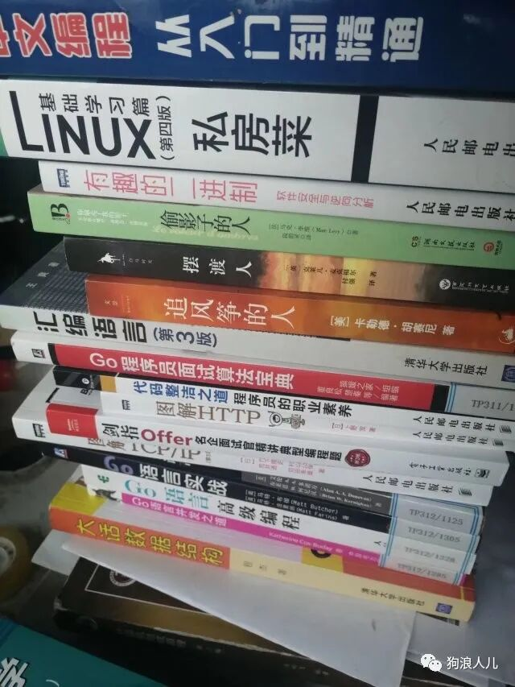
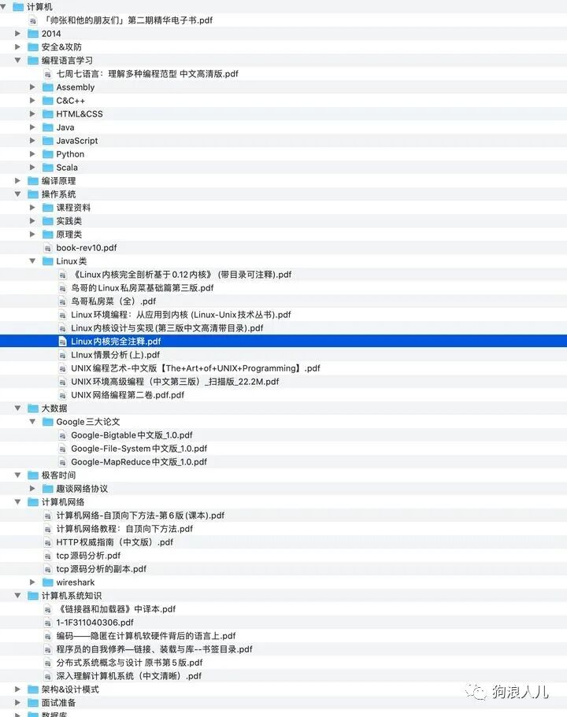

> 本文原载于我的微信公众号「狗浪人儿」，发布于 2022 年 4 月 26 日。[查看原文](https://mp.weixin.qq.com/s/FJ2fPmz3FmhJms4Tmv6SjQ)。

点击上方蓝字点个关注🌟
有趣、有干货。

从大一开始，我就很喜欢看各种各样的书，不仅是技术的，也有散文。越读感触越深，发现书不在多，而在于经典，例如计算机传统黑皮书，CSAPP等等。

你在不同时间读同一本书，甚至同一段文字，收获都是不一样的，这一点相信大家都有感触，不仅是阅历变了，也是对不同知识理解角度不同了。

我主要是做软件后台开发的，所以推荐的书可能偏后端一点，但是关于计算机通用技术的基础书都是类似的。

这是我大学借过看过的部分书：

大一借过读过的书

在这里我也只推荐我觉得比较好的书，宁缺毋滥。

<strong>微信搜索「狗浪人儿」关注后，在后台回复「书单」即可获取本文书单</strong>

<strong>回复「pdf」即可获取本文提到的所有书籍电子版pdf</strong>

介绍我就不写了，因为书有点多，介绍写太长会导致文章太长。

这些书，大家可以根据名字去豆瓣看看书评，都是非常好的书，直接盲买也不会出错。

## 语言类

### C语言

- 《C程序设计语言》
- 《C和指针》
- 《高质量C编程指南》
- 《C专家编程》和《C陷阱与缺陷》，这两本有时间可以看
- 《C 语言接口与实现》

### C++

- 《A Tour of C++》
- 《Accelerated C++》
- 《C++ primer》
- 《STL源码解析》
- 《Effective C++》
- 《深度探索C++对象模型》
- 《C++设计与演化》

### Java系列

- 《Java 核心技术 》
- 《Effective java》
- 《深入理解 Java 虚拟机》
- 《Java 并发编程实战》

## 算法与数据结构大类

- 《大话数据结构》
- 《算法（第四版）》
- 《算法导论》
- 《编程珠玑》
- 《 算法概论》
- 《算法设计》
- 《 编程之美》

## 编程实践

除了基础，动手做项目也同样重要，如果没有项目是过不了大厂的简历筛选的。

### 网络编程

- 《Unix网络编程》
- 《Linux高性能服务器编程》
- 《Linux多线程服务端编程》
- 《计算机网络-自顶向下》
- 《TCP/IP详解-卷一》
- 《UNIX 环境高级编程》
- 《代码整洁之道》
- 《设计模式》
- 《代码大全 》
- 《程序员修炼之道》

### 代码&程序设计

- 《计算机程序设计艺术》
- 《重构》
- 《计算机程序的构造与解释》

## System

计算机基础是大厂技术岗校招的核心考点，必须重视。

### 系统编程

- 《编码：隐匿在计算机软硬件背后的语言》，适合初学者
- 《深入理解计算机系统》
- 《程序员自我修养》，别被名字迷惑了，这本书真正该叫《编译链接与运行》，好书推荐
- 《设计数据密集型应用》
- 《链接器和加载器》
- 《COM本质论》
- 《代码优化：有效使用内存》

### 操作系统

- 《现代操作系统》
- 《操作系统真象还原》
- 《Windows核心编程》
- 《深入理解LINUX内核》

## 软件开发&其他

多看一下其他计算机行业大牛的故事有利于摆正心态，走出当前阶段的困境，也十分有必要。

- 《程序员修炼之道》
- 《UNIX 编程艺术》
- 《人月神话》
- 《黑客与画家》
- 《清醒思考的艺术》
- 《当下的幸福》
- 《异类：不一样的成功启示录》
- 《漫步华尔街》（了解下资本的运作
- 《领域驱动设计》

。。。。未完待续，后续会整体得更完善，更加成体系。

另外，再送一份大学期间积累的电子书库，汇集了编程语言(Java、C++、C、Python等等)、操作系统、计算机网络、系统架构、设计模式、程序员数学、测试、中间件 、前端开发、后台开发、网络编程、Linux使用及内核、数据库、Redis\.\.\.\.等主流的编程学习书籍。这部分我是会不断把它完善的，当成自己的小电子书库，不多，但贵在精。

书单部分截图

<strong>微信搜索「狗浪人儿」关注后，在后台回复「书单」即可获取本文书单</strong>

<strong>回复「pdf」即可获取本文提到的所有书籍电子版pdf</strong>
