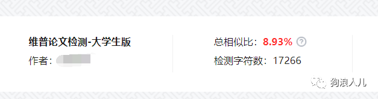
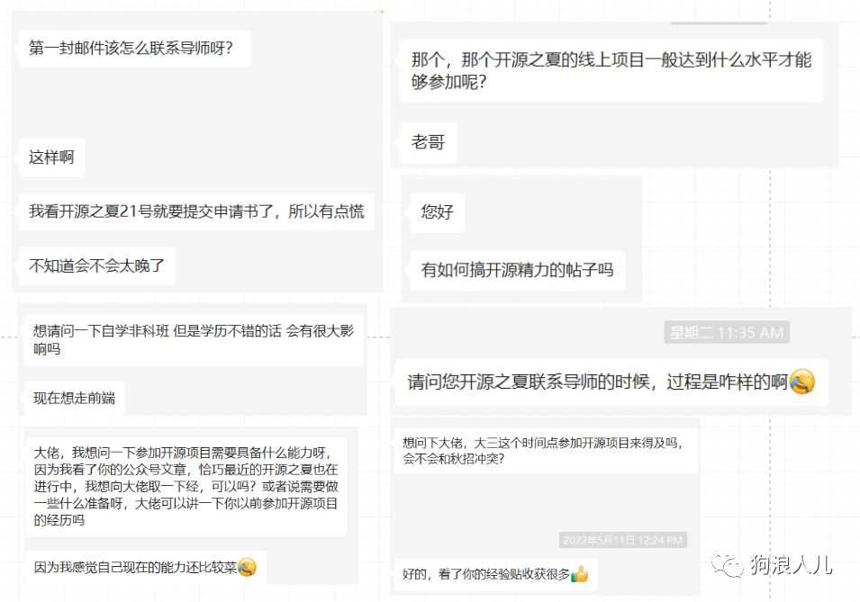
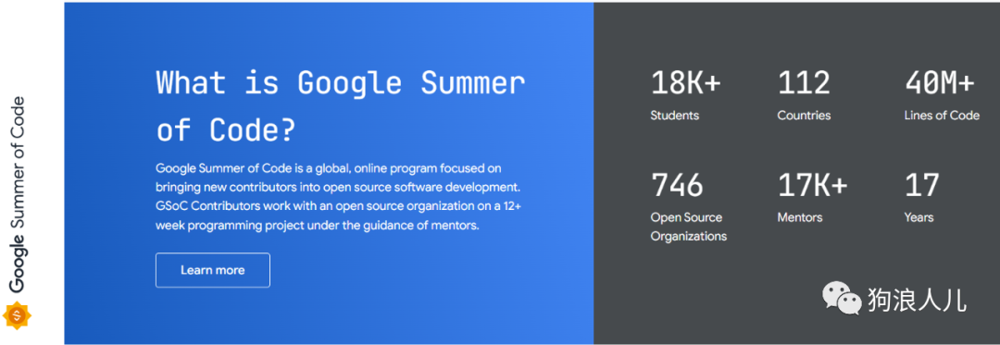
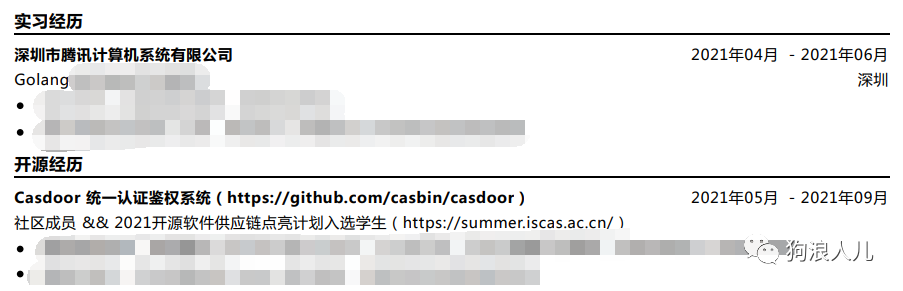
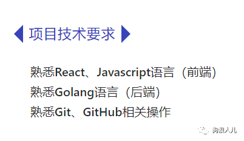
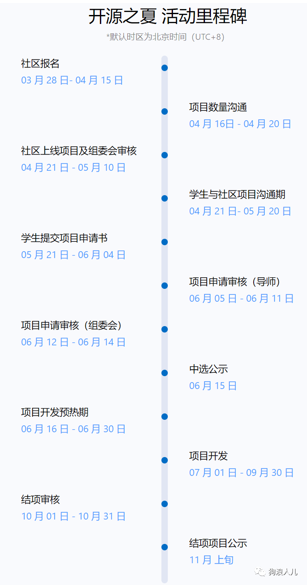
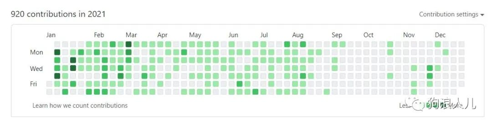
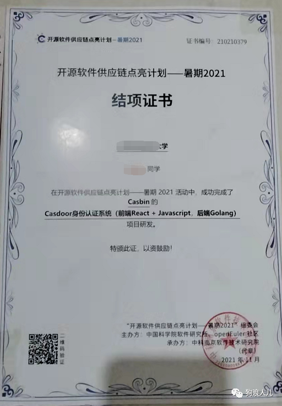

> 本文原载于我的微信公众号「狗浪人儿」，发布于 2022 年 5 月 22 日。[查看原文](https://mp.weixin.qq.com/s/e9N0dNrqMpFjGUXD9Eh9Tw)。

大家好，我是wasabi，好久不见，也是有半个多月没有更新了，主要是因为最近在忙毕业设计，做一些诸如录制演示视频、论文格式检查等等的琐事，最终查重降重到 8% 左右后便草草了事，总算是搞定了论文和答辩。

接下来就是准备毕业，收拾东西，多拍一些照片，然后离开这个呆了 4 年的地方，也许永远也没机会再回来了。

## 前言

回归正题，好多朋友私信问我诸如「如何参与到某个开源项目」、「参与具体需要什么技能」等等问题，好多问题十分相似，对想参与的人来说十分重要，我觉得有必要单独出一期详细介绍。

之所以这么着急，也是因为马上开源之夏的活动报名就开始了，为了让大家在今年求职难的时候更卷 ，不影响大家参与今年的活动，这期我就通过这篇一站式攻略，<strong>帮助大家解决所有疑惑，顺利参与项目，最终收获开源经历，在秋招中拿到自己满意的Offer！</strong>

<strong>我先讲解一下活动参与流程和细节，最后再集中解答大家的疑惑。</strong>

## 如何从零开始参与开源活动？

介绍流程之前先简单介绍一下开源活动，帮助大家从根源上理解这个活动。

### 开源活动究竟是什么？

目前开源活动有两个，<strong>谷歌编程之夏（Google Summer of Code）</strong>[1]，是Google 赞助并组织发起的，简称 GSOC，和<strong>开源软件供应链点亮计划</strong>[2]，这个是国内中科院软件研究所和 OpenEuler 主办的。两个活动的目标很一致，在官网首页就能看到，我举例国内活动的活动标语：

<strong>旨在鼓励在校学生积极参与开源软件的开发维护，促进优秀开源软件社区的蓬勃发展，培养和发掘更多优秀的开发者。</strong>

除此之外，<strong>活动联合国内外各大开源社区，针对重要开源软件的开发与维护提供项目任务，并面向全球高校学生开放报名。</strong>

我之所以另起一段还加粗显示，是为了让大家认识到这个活动的目的是为了让大家学习并参与到开源项目中，这不是比赛，不是发表论文，<strong>只是一个活动，只为大学生开放的活动。</strong>

所以大家不要抱着我会不会太菜了、不够资格等等心态，这个活动的初衷就是由官方出钱让吸引大学生多了解并参与开源项目。

官方不仅会开放学生申请，也会开放社区申请，那些觉得自己还不错的社区可以向官方申请参与这个活动，这样社区可以获得学生，还是由官方出钱，美滋滋。但是是对社区有审核机制的，GSOC 的社区有200+，我记得国内的 Casbin 是近两年唯一一个入选中国社区。

所以作为学生，我们既能学习参与，又能获得一笔不菲的奖金，何乐而不为呢？晚知道的我只恨因为信息差耽误了几年时间:(

可以这么说，<strong>一份不错的开源项目经历的含金量完全不输大厂实习</strong>，如果能有实习+开源经历就更好了。

比如这是我秋招时的部分简历，在当时还是有一定竞争力的。

> 值得一提的是，GSOC 作为全球最大规模的开源活动，由 Google 主办并赞助，全世界参与者内中国学生的参与人数在前两年只有不到50，是最少的，而印度学生是最多的。可能也是国内关于开源这块的宣传不够到位，很多同学有心参与，却不知道这个事情，实在是可惜。这也是信息差的无奈，所以我创建了这个公众号，也是想帮助大家解决这个障碍，尽一点绵薄之力。

### 参与需要什么硬性/软条件？

回归主题，上面提到的两个活动的硬性条件只有两个，缺一不可。

- 必须是学生，研究生也可以，总之要证明你的在校身份。
- 需要一份简历，英文名为 Proposal，即提议/方案，来说明你的个人情况，例如你是否有过xx经历，掌握yy技能，熟悉zz经验等等。

之所以叫 Proposal 是因为需要写出你对需要解决问题的思考或者是解决方案，表达你有一定想法，这一点根据不同社区的要求不同，下面我会详细再说。

<strong>除此之外其他的一切条件都是附加的</strong>，例如「你的某项技能掌握如何」、「是否参与过类似项目」等等都不是必要条件。这些只是你的加分项，是你竞争名额的加分砝码，仅此而已。

说实际一点，还是需要你有一定工程落地经验，比如你知道如何通过一份未曾见过的新项目 Readme 能自己将这个程序从零构建编译并跑起来，还有你曾经尝试通过 Git 分支管理来合作开发，再比如如何编写适应性强的代码，而不是无脑的 if 堆砌，任意变换需求就需要推倒重写。

这些都是可能需要用到的技能，但是具体需要什么能力还是需要结合某个项目，因为你负责的任务是不同的，难度也是不同的，但是正如我在秋招经验贴中说的，总体不会太难，因为你只负责某个模块，你甚至不需要理解所有模块（大多数可能也理解不了全部），期间还有许多参与者可以交流，会使得整个过程变得十分容易。

### 实际报名

好了，说完了上面这些你需要提前知道的和准备的，接下来就是正式开始报名了。报名流程公开透明，也十分简单，不存在什么暗箱操作。

站在主办方的视角，社区和学生是同等身份，社区需要向主办方报名参与活动，学生需要向社区提交申请，主办方不存在倾向、恶意的心态。

举个例子吧，我当时参与的社区不看重 Proposal，要求按照 PR 质量来决定是否审核通过，在报名期间，官方给我们几个报名的同学挨个打电话询问该社区的审核标准（也就是通过 PR 而不是 Proposal）是否是公开修改并通知的，也是怕出现暗箱操作，所以大家大体上可以放心。

首先你需要关注一下活动的流程，例如<strong>开放注册</strong>、<strong>联系导师</strong>、<strong>开始报名</strong>等时间节点。如果错过了就没办法了，单个社区是没有权力修改规则让你参加的，联系官方也不会破格让你参加，只能等第二年了。

从原则上来说，大家报名是不分前后顺序的，但是如果你能之前长期获得社区/导师认可，那么在正式报名的时候相当于你是被”内定“的。

再举个例子，在我参加的时候，有一个项目的某个同学已经<strong>连续提前贡献了半年</strong>，那你说其他人还怎么跟他竞争，自然而然这个名额就是他的了，当然大家也不用担心，因为这些信息在你报名时导师会告诉你的，如果没有名额了或者竞争压力很大，导师会让你同时考虑别的项目，这些都是透明公开的，不会存在什么恶意竞争。

在报名时只需要选择社区中的某个项目，然后上传自己的简历（或者是 Proposal），等待审核通过就可以了。

在这个期间，你需要不断与社区/导师保持联系，让他们注意到你是要参与到这个项目中的，如果能做一些实际的贡献，比如解决一些 Issues 那就是再好不过的了。

### 入选后如何具体参与到活动中？

<strong>参与的形式是贡献开源代码</strong>，需要合作开发，需要用到 Git 版本控制工具，这个需要熟练掌握，比如回退版本，合并节点等等基础操作。

活动有一个周期，大概是3个月+，<strong>在此期间你需要通过 Pull Request 的方式向中选项目仓库提交代码</strong>，中间会经过一次中期考核，形式是上传一份文档，说明你在前半段时间的工作/研究结果，考核通过后会发放一半奖金。结项的考核方式与中期相同，考核通过后发放另一半奖金、结项证书和纪念T恤等等物品。

我让我妈拍了一下放在家里的结项证书，像素实在不咋地，大家凑合着看吧 :D

在活动期间大家的交流方式大多都在 GitHub 上，少部分会通过邮件来沟通，所有交流大都公开透明，有问题直接 comment 或者发邮件提问。

## 答疑解惑环节

上面我对开源活动的流程进行了系统介绍，接下来再回答一下部分同学的其他相关问题、顾虑，希望对其他同学也有帮助。

1. <strong>因为国内的这个活动整个周期大致是5-10月，参与这个活动会不会影响应届生秋招？</strong>

wasabi：这个问题问得很好，GSOC 整个活动参与时间是3-9月，两者都覆盖了秋招黄金时间，但是不用担心，这个活动并不是占据你的全天时间，它是任务周期制的，你需要完成了你负责的 Issues，你就放假了，等待下一个任务/下一个任务周期，平均每周也就花费十几个小时，不会耽误秋招进程。

我用我的秋招经历向你保证，我是在这个周期内实习+开源活动+秋招的，大家可以放心。

1. <strong>如何提前联系导师？</strong>

wasabi：官网社区介绍的地方都会展示社区的联系方式，这里大多是邮箱，也有各种 IM 群，例如 Gitter/TeleGram/QQ/WeChat 群等，直接发消息就好，别担心，不是相亲，不用害羞，说不定导师比你热情。

1. <strong>时间来不及了怎么办？</strong>

wasabi：因为信息差，我也错过了大二时的活动，导致只能大三时参加，和其他事情混在一起。这里我建议你两手准备，国内国外的都关注，这两个活动开始时间相差几个月，错过一个等另一个，都错过了就抓紧准备，来年两个一起考虑，争取成功参与一个。

1. <strong>这个简历和秋招简历有什么区别？</strong>

wasabi：这个问题问得很关键，千万别发自己的秋招简历，简历上你的个人技能/自我介绍等等信息大多都没用，是无效信息。还是需要重新写一份。

具体怎么写这个跟社区有关系，不同社区的要求不一样，甚至有的不注重 Proposal，比如 Casbin 社区导师罗老师就直接说了注重代码能力，直接贡献，看谁的贡献好质量高，这种很特殊。

大多社区要求你写出对 Issues 的解决方案，表达你的解决思路，让社区认为你能搞定，比如前年我在关注 GSOC 某社区时里面的要求是这样写的：需要你对下列 Issues 的几个进行解决，尝试搭建并运行项目，写出思路。

总结来说，这个简历跟社区强关联，需要你提前联系目标社区，看看导师的要求，不要盲目投。

## 总结一下

实话实说，开源项目的经历在大学阶段十分难得，大多数同学很难接触到有价值的开源项目，都是用 Git 维护一下自己的小玩具，做一些诸如 `git add .`、`git commit -m "feat: xx"`、`git push`等等的最基础操作，可能用了 N 年 GitHub 还是只会这几个命令，也实在是没办法，确实比较难接触到，就算「有一定实力」也会因为社区这样那样的原因劝退。

这个活动最大的好处就是帮我们打通了“入门难”的问题，帮我们建立了社区和学生之间的桥梁，给了我们平台，还有一笔不菲的收入。

我可以坦白地讲，如果能收获一份不错的开源经历，争取再有一份大厂实习，拿到几个大厂 Offer 应该没什么难度。我在秋招时基本没被问过常规八股文，问题都是集中在项目和实习上，由此可见重视程度。

当然了，我也只是作为曾经的参与者表达了我的看法，难免有偏差和遗漏，如果你有什么问题和想法，也欢迎通过公众号下方的「联系作者」和我交流。

最后祝大家都能获得满意的开源经历和校招 Offer！

---

### 参考资料

[1]

Google Summer of Code: https://summerofcode.withgoogle.com/

[2]

开源软件供应链点亮计划: https://summer-ospp.ac.cn/
