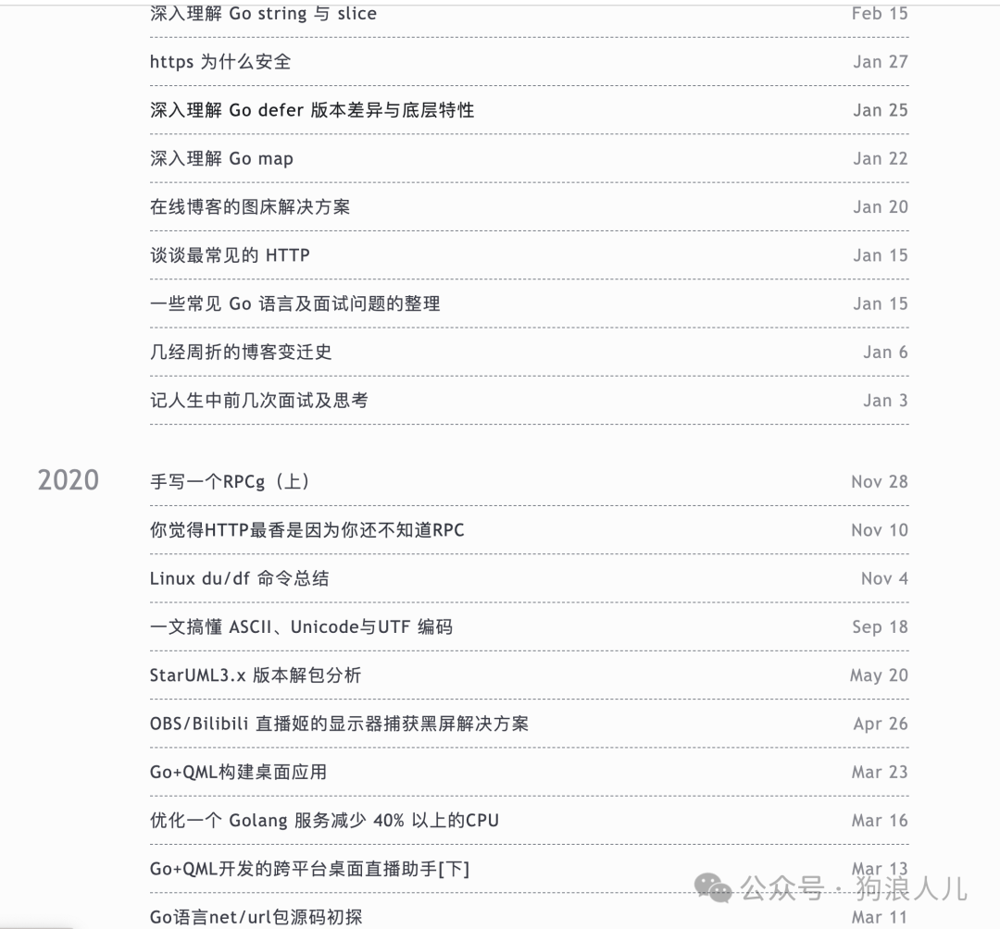
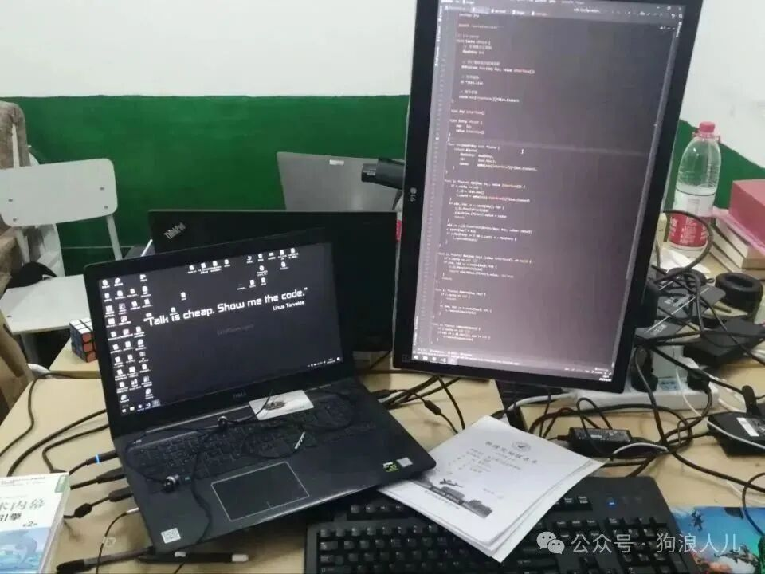
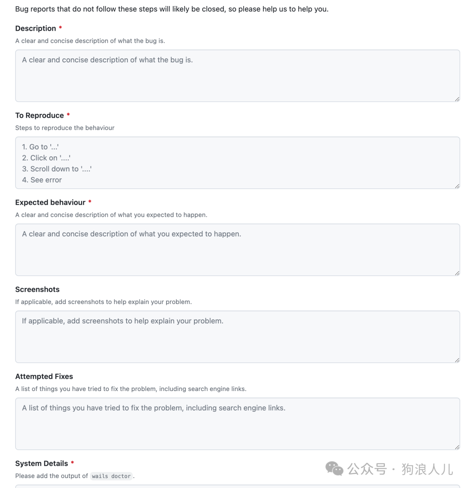
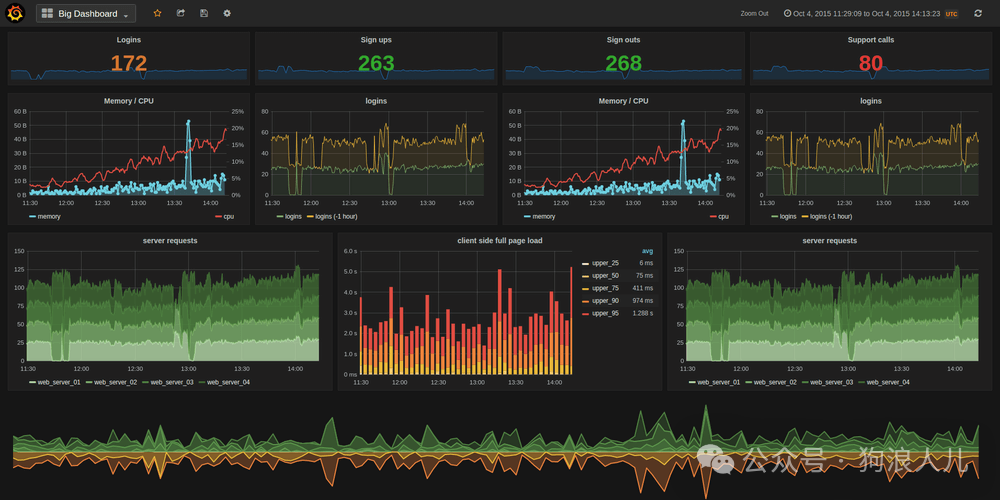
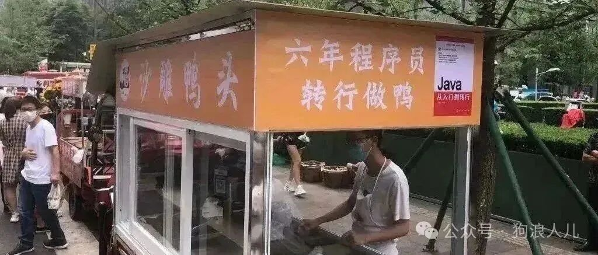
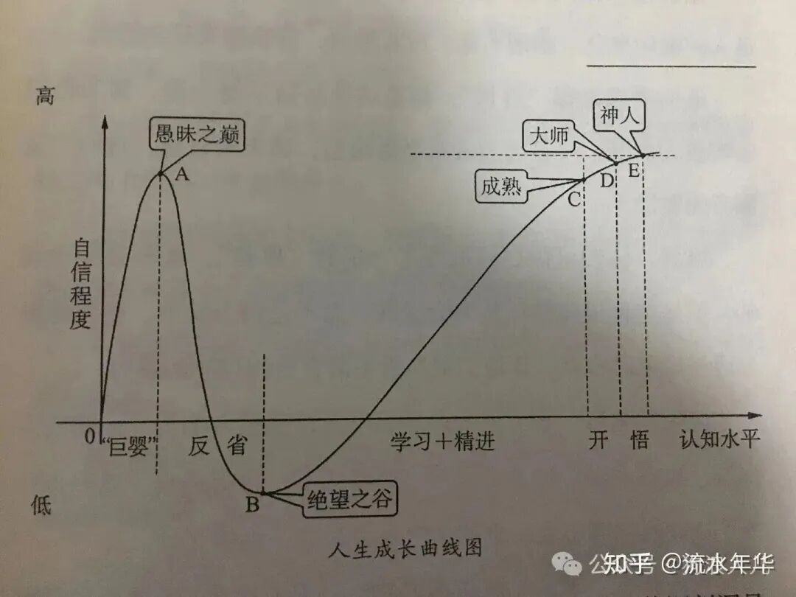
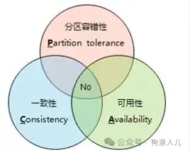
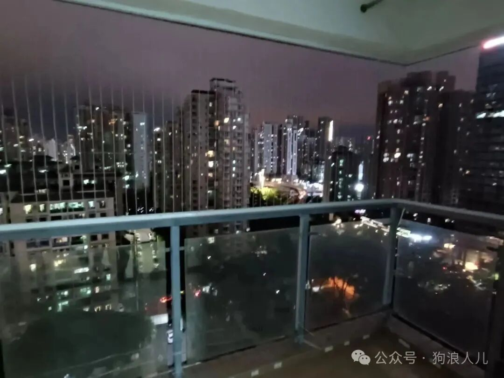
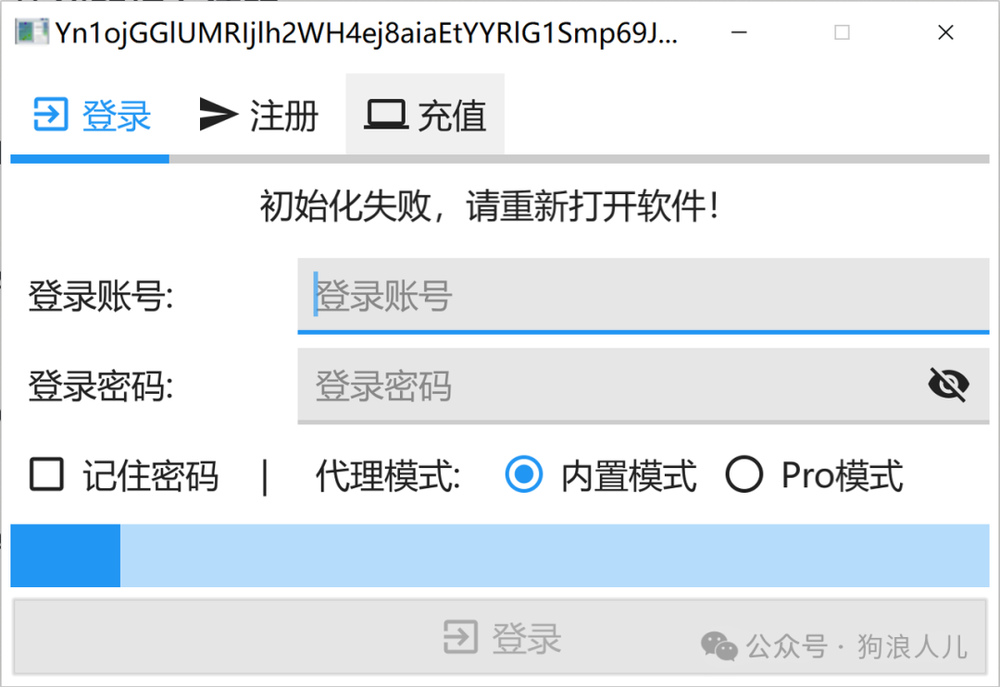
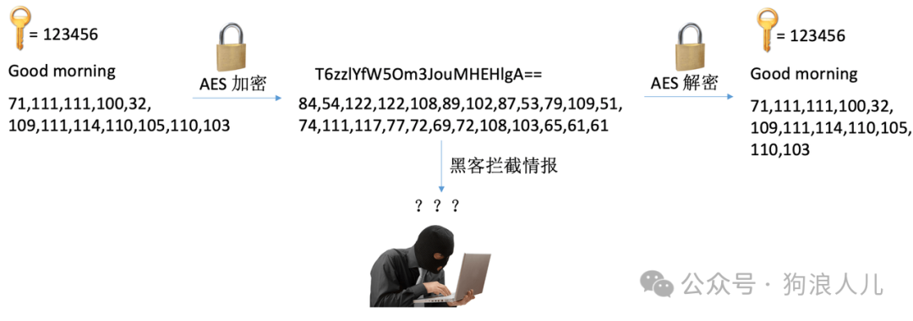

> 本文原载于我的微信公众号「狗浪人儿」，发布于 2024 年 2 月 14 日。[查看原文](https://mp.weixin.qq.com/s/ysqttHnnOwCDPhGLUmemoA)。

哈喽大家好，我是wasabi，好久不见。

这篇内容能发出来实在是不容易，中间停停写写不知道拖延了几个月，看了眼博客的标题还是 2023/4/1。曾经很喜欢记录写写东西的我在工作后也懒到了极致，变的很势利，眼里似乎只有钱。

很长时间没有营业，连大学时期折腾了好几年的博客，从最初的用个人服务器维护 Hexo 服务，到最终的 Github Page+Actions，搭配 Hugo 全自动部署托管，到现在也吃灰一年多了。

曾经的博客记录

把这篇博客在春节假期内写完，也是给过去一个收尾、给一年多的工作一个交代，也希望能结束目前糟糕的工作和生活状态，<strong>积极思考，面对更长远的未来</strong>。

如果还能帮到你，那么我很高兴。

## 主要分为以下几个中心点：

1. 高效沟通的能力
2. 减少精神内耗和独立思考
3. 从程序员到工程师
4. 成长是自己的事

最后再聊聊工作感受，一些租房试用期以及我的副业。

<strong>在一切开始之前应该恭喜一部分读者:D:D:D</strong>，成功参加了开源活动并结项，找工作应该算是一个加分项，在这个当下环境不太好的时候，希望大家尽可能丰富自己的经历，找到一个满意的工作。

## 工作之前

回首往昔，路途实在坎坷，感慨颇多，深知河南中底层学生的痛苦，在寒门中奋力向外爬的过程中，恰巧赶上了互联网时代的红利，小有积蓄，经历了纯粹的深圳工作和家乡的生活切换后，万千思绪更是汇集在指尖，一瞬间想化身六指琴魔，迫不及待地想记录下来。

大二时期的工位

早先的经历总结可以归结为一句话：人菜瘾大，后知后觉笨鸟先飞。不过一切的一切不过是人生漫漫路上的一步棋，落子无悔、观棋不语，走好自己的每一步，<strong>不必总是用当前的经验和立场为过去惋惜，人永远无法同时拥有青春和对青春的感受</strong>，执拗的一代一代的青年人一定会明白心头的白月光终究会成为历史。

## 工作之后

### 高效沟通的能力

<strong>合作是共同做事，归根到底还是与人的合作</strong>。如何与他人融洽地交换思想，让对方理解自己的观点，我逐渐发现这是一项很重要但是容易被忽略的技能。

<strong>信息熵</strong> 用来表征 <strong>符号系统中单位符号平均信息量</strong>，说白了就是同一本书，评价译本厚薄程度，甚至还给出了一个计算信息熵的公式。目前 <strong>中文的信息熵最高</strong>，也就是说，<strong>同一本书，中文的版本会更薄</strong>。

这个概念在生活和工作中的场景有很多，比如试图向对方表达清楚一个观点或想法，最少可以用多少个字，提升这个能力来避免反复嚼舌、车轱辘话，从而尽力避免对外体现为表达能力欠缺。

解决方案也有一个很常见的做法，例如利用总分、分总结构，举个例子，如果想描述一件事情X的现状，可以采用以下套路，

- X目前符合预期（可以指进度、效果等）
- 目前的进度、效果是Y，但是存在一些问题Z

《提问的艺术：如何快速获得答案》更是用一整本书来阐述如何高效提问，作为互联网从业者应该更有体会，甚至会有一个共识：

<strong>大多问题往往自己解决比询问他人更有效，沟通的花销有时会远大于解决问题本身。</strong>

向开源项目提问时需要准备的描述

仅仅一个 为什么我的电脑上不能运行 QQ 的问题，不提供足够背景的情况下，排查方法足够让人爆炸，可见一斑。

1. 软件包是否完整？是否能提供此软件的运行时依赖？例如.dll/.sys文件？
2. 软件是否需要安装第三方的运行时依赖？例如vc140.dll文件？
3. 系统是否与软件的编译时指令集匹配？例如amd、arm？
4. 软件的配置文件是否无误？

这和解决问题者的水平往往没有强相关性，哪怕是十分专业的系统工程师，往往更需要非常充分全面的上下文才能解决哪怕最终看起来很简单的问题。

在更复杂的环境中更是如此，<strong>沟通是为了解决问题，一定在提问前多问自己几遍</strong>， 不要将情绪带入到工作中，心平气和、理性地思考当前所面对的问题，高效沟通。无论外界情况如何，带着情绪通常并不能解决实质问题，<strong>做好自己，交流是为了解决问题，而不是争吵</strong>。

### 减少精神内耗和独立思考

当前时代的灰尘平均分给了所有年轻打工人，成为了每个人身上的一座大山，我们常常被迫担心诸如是否会说错一句话而让他人不舒服等等“鸡毛蒜皮”的事情，不能专注在事情本身，耗费精力。

> - “人在饥饿的时候只有一个烦恼，其他烦恼都是吃饱了撑的”。
> - “无病呻吟”

工作可以离职，社交可以退出，世界不会因为任何一个人停摆，少想，多做，<strong>坚持做自己，不过度解读他人，我们控制不了外界，但可以不给自己徒增烦恼</strong>，做好自己真的很重要。想得太多有时候也不是一件好事，因为除了想，什么也做不了。

看起来很完美的诠释了一些心理状态，我觉得这也是很多网红在大家都尽力表演花活的时代仅仅凭借着朴素接地气也能爆红的原因之一。

我们从小就被灌输要骑在别人之上，从小时候的成为”人上人“，到长大了的电子产品全家桶、化妆品或大房豪车，走着既定规划好的路线，这一切似乎都顺理成章。<strong>但是没人告诉我们生活的意义是什么，我们也许从来不明白独立思考意味着什么，思想上的防火墙牢牢地束缚住了我们，这墙比构建局域网的 Great Fire Wall 不知道要厚和高多少倍</strong>。

入行所需要掌握的信息搜集能力足够去辨别一些是非，充足的信息输入是独立思考的基础，想清楚一件事的投入产出比更是成功的第一步。

我也经常胡思乱想，总是在思考工资、工作、社交等等各种各样的事情，有时轻则会让我情绪低落，重则六神无主，把真正重要的事情做错。

后来慢慢地发现精神内耗往往都存在于刚毕业的青年人，但凡到了中年，往往都会意识到有些事力所不能及，<strong>看清了一些事情的发展规律，认清了现状，也就不“挣扎”了</strong>。在我见到的经验丰富的同事中确是如此，他们心态平和，仿佛置身世外，泰然自若。

未来的路就那么几条，现在想想互联网上信息过多有时候也并不是什么好事，筛选信息也许和查找信息一样困难，只不过经过这二十年的发展有了些许改变，<strong>从宝藏中寻找心仪的钻石到在垃圾中寻找合适的零件</strong>。

过去的经验不断地鞭笞着我，有人领路往往比低头慢走强得多。有一些弯路是不必要的，它们并不会成为垫脚石，只会浪费我们做正确事情的精力。因此我非常感激我的导师，曾经勉强有老师，但是工作后我很难找到可以咨询的同龄前辈，能找到愿意和你分享的经验丰富的人更是非常难得。

### 从程序员到工程师

工作一年半，我把几个称呼的界定划定地更加清晰了，一个计算机行业从业者从 实现产品功能 到 设计业务模块，最终对“三高”的复杂服务有系统性思考和解决方案，对应了完全不同的传统意义上的职级划分。

在数据量和服务诉求逐渐提高的过程中，系统复杂性会呈倍数扩张，因此一些规模较小的“玩具系统”不在讨论范畴内。《数据密集型系统设计》更是用了一本书来解释如何多方位保证一个业务系统可用。拓展性、可维护性，抵抗异常的可用性能力都是需要考虑的因素之一，软件系统的架构设计与土木、航天同样复杂，搭建过夜小木屋和建造阿利法塔无法相提并论，软件系统同样如此，在QPS很低的情况下没有设计可言，更不会遇到复杂的问题，进阶难题也同样不会暴露出来，可一旦增加规模，可用性等需求，甚至连地震、火山爆发导致的机房损坏都需要考虑在内，如此衍生出了多活、分布式及副本的概念。

三大利器之一，监控

站在更高处看问题，根据划分系统的模块层次，解决问题的深度和广度，我觉得是工程师能力的关键，同样也是从程序员从实现需求功能到系统地思考软件架构体系的转变。

有一个简单而又发生在身边的例子，国内某游戏厂商可以维护出全年上亿交易量可用性5个9的商城交易系统，而某外包公司在某个期间制作的扫码查询功能却因实时流量超过预期而宕机超过24小时无法恢复。这固然有资源投入的差距，但是不可否认这不是一码事。

服务质量下降时的影响

工程师的能力和经验是需要在长期的实战中思考、总结出来的成果，很显然现在的我还有一段很长的路要走，即使我认为年龄大依然是工程师的一大优势，因为ta可以有丰富的系统设计经验，与一位年长、经验丰富的一线临床手术专家，拿捏八大菜系的厨师一样，

概括地说，发展过程大致分为三个阶段，

1. 考虑问题不够全面的程序员
2. 执行和排障能力一流的开发者
3. 系统和决策经验丰富的工程师

他们的前者都是后者的子集，坦诚的说，我还是一名程序员，虽然第一年的工作在一定程度上增加了我对职业认知的广度，但垂直领域的掌握还是需要靠积累去探索、钻研。

不过实事求是的说，客观的互联网市场决定了部分人的就业情况，35岁的年龄门槛倒逼从业者们成长，相当于给定时间，完成一个从程序员到“工程师”或“管理者”的任务。

很容易理解，但却很难让人接受，并且是一个目前来看短期内不会结束的事实。这限制了从第二阶段到第三阶段的一大批人的转变，许多人还来不及成为一名超一流的工程师，就遇到了市场限制，从而被迫退出，对于国内部分工程师实属是一种打击。

系统客观地讲，趋于年轻化也意味着整个软件行业浮躁，急于实现业务能力和变现，压根不太需要高阶的设计者，导致能跑就行、降本增效逐渐成为了主流声音，进而不太重视基础能力、工程师的核心素质的结果大概也是国内大厂商频繁事故的原因之一，同时也是各种CEC-IDE、大模型等软件或服务抱着国外开源大腿，换皮当成国产产品背后的悲哀。

很难想象三十多岁，正当熟悉了各种规范，系统设计思路的研发人员，正准备利用自己的积累大展身手的时候，却被迫回去卖煎饼果子了，是一种什么感受。

还有转行卖烤冷面和炒粉

### 成长是自己的事

这句话是挪用自公司的一句口号，我觉得是有一些道理的。

确实，重复、没有创造性的工作会让我们做起来慢慢地游刃有余，我们也总是乐于待在舒适区中的，“反人类地”跳出舒适区实际上从生理上就非常难，因为外出捕猎总是危险的。

长线来看，在垂直领域探索有利于提高自己的核心竞争力，在有限的精力内专心负责某个方向似乎也是最优解，可归根到底，人终究是人，下班后还有精力看书学习是一件任何一个打工人都明白的难事，感谢热爱的浪漫和生活的疲惫斗了那么久。

曾经大学时期的我因发现了一个实现了心中所想功能的开源仓库，兴奋地熬夜逐行阅读源代码，那时的我无论如何也想不到如今的我下了班除了钱一切都提不起兴趣。曾经申请向图书馆买书来看的我，怎能想到现在看到整篇充满文字且没图的一页时只想快速翻过去。

我承认这很难，唯一能说服我做下去的理由是 这是一笔长线投资，用现在的反人类的痛苦来换取未来的知识壁垒，说来说去又回到了原点，从学生到工作，从工作又到下一个阶段的工作\.\.\.各种各样的压力不断地催促着我们，过去是成绩，当前是房车，未来是家庭。

回头看看，大学时期能坚持思考、不断探索的那段时光是最难忘的，不断沉淀、积累，才有了现在的我，结论大致是 <strong>尽早坚持做更有意义的事</strong>。低头想想，工作是相对长期的事情，如何在更长的时间内 <strong>保持成长</strong> 对成年人更重要。

成长规律

## 过去一年的工作

工作一年多的感受可以说是五味杂陈，并没有我想象中的那么容易，远比大学时期去“写玩具”复杂的多，工作的日子不仅有写代码，更多的是沟通，项目需求中各种琐事，没有个人目标，时间真的过的很快。

1. 沟通需求，完成开发测试上线。
2. 保持交流，避免产生琐事。
3. 担心跳槽晋升，职业生涯。

在没有清晰思考和规划的前提下，刚毕业的我很难适应，躺着、玩基本变成了工作之外的唯二状态。很难相信，去年毕业前我还愿意折腾plan9汇编去完成毕设，做一些感动自己的事情，而现在空余时间如果非必要我连优化一段复杂的写法都不愿意去做，懒真的成为了生活的主旋律，<strong>没有规划、没有强烈的压力真的很难让我积极主动地做一件事</strong>。

### 截至目前的工作感受

感谢身边同事的包容，在职业素养方面的提升自我感觉最明显，大概可以概括为一句话，<strong>如何作为一名技术人员与不同角色的同事合作，共同完成一件事情的综合能力</strong>。除此之外也包含对生活、工作等各方面的认知提升，我觉得这对我短时间内可能帮助有限，但是长期来说是更有价值的。

真不累

学习交流沟通的能力，对我来说是一笔不可多得的财富，这段时间我并没有获得多少技术上的提升，原先不会设计的系统我现在依然不会，之前不会写的算法我现在依然不会，但是成长的曲线总是有规律的，也一直都是一个需要不断学习的职业，保持成长才是最重要的事情，在我看来跟厨师非常像。虽然工作之后我也买了一些书，但至今也没认真读过。

为了对抗工作后时间飞逝的问题，我打算尝试定期更新简历的方法，同时翻阅一些社招面试的常见系统向难题。回顾一段时间的经历，尝试写下来的同时，也推动一些系统思考和沉淀，总而言之我觉得始终要有一个想法，<strong>工作是做不完的，成长是自己的事。</strong>

这部分会作为后续的长线内容题材。

## 试用期、租房、实习等

最后聊聊部分读者比较关心的一系列问题，也许这部分之前的提问者都已经工作了:(

关于试用期是否需要答辩，以及具体多久通知，这个与部门强相关，有的部门没有试用期，不需要答辩，有的提前转正，如果不过一般会提前一个月通知。我们部门的试用期是半年，需要答辩，部门的+2也会参加。

与社招不同，校招的同学们只需要按部就班写好总结准备，正常发挥就可以了，一般情况不会个人原因被辞退。我们部门的试用期通过后没有邮件通知，所以也需要根据各自业务部门的情况，

### 租房

我相信每一个第一次来大城市租房的同学，在没有前辈帮助的情况下都或多或少踩过坑，在这里分享一下防止大家继续踩雷选择租房地点、租金。

总的来说，不会出现太完美的房子，因为<strong>租金、环境、地理位置</strong>这三个因素形成三角之势总要取舍。

无法同时满足

由于公司大多在商业区，如果选择距离公司近的，大多都很贵而且很可能没有独卫、户型还不好，但是如果你选择通勤一个小时，那就能花一样甚至更少的钱住到更宽敞更大的大开间独卫（很方正，而不是S型的房子，我就见过。

拿深圳南山大部分互联网公司举个例子，如果选择通勤30分钟内（有房补），环境正常要求独卫，不会少于2.5k，大开间地理位置好的优质小区5k也很常见；如果选择住宝安，那么2k+就能住到30平大开间，但是通勤一个小时。

所以在租房前，大家<strong>要先有心理预期，给出自己权衡的倾向</strong>，给出预算范围，另外也要多看看，因为充足的信息输入是合理判断的基础，在对租房的情况有一定了解，也方便自己对实际情况进行综合比对，也防止踩坑。一般这几个因素含有的越多价格就越贵，<strong>独卫</strong>、<strong>大窗/阳台</strong>、<strong>周边环境</strong>

3300大阳台+厕所在对面的15平单间

### 一点小副业

简单聊聊我的副业，因人而异，没有太多参考价值。

副业分为很多方向，基金股票理财，写文章做知识付费，做短视频搭建个人IP等等，差距更是大的出奇，不乏有一些IT网红副业过百万辞职主业的案例，但具体还是 <strong>要根据个人情况</strong>，毕竟让极度社恐的同学露脸分享讲故事、晒食堂的话还不如直接放弃hh，选取适合自己的才是最好的。不过最重要的是，前期不要影响主业，不然哪天副业还没来得及主导就成为了主业就比较尴尬，得不偿失。

比如目前短视频的风口上有许多人选择尝试自媒体，是一个低风险低门槛，但却可能高收益的选择，简单到只需要一部拍摄设备随手一拍，复杂到各种数码设备，炫酷的转场剪辑，门槛低上限还高。

早在2023年年初，我就在尝试找副业，找来找去还是回归了老本行，写一些付费软件。

曾经的自绘UI

这里我分享几个遇到的问题，希望对软件开发者们的技术变现有帮助。

- 登录验证系统。即需要支持用户付费后，才能在规定时间内使用软件。

- 针对 Web 服务，业界有许多验证方案，大致的思路非常简单，服务端验证通过后下发 Token，所有接口均需要携带该 Token。
- 针对重客户端应用，需要着重做好二进制防范，与验证服务关系不大，复杂高端的服务端程序在裸奔的客户端应用面前一无是处。
- 服务端部分大致有三种解决方案，自己写、二次开发和买。我个人起初选择找了一个按月付费的在线验证服务，又编写了登录验证窗口，支持了注册登录充值等基本功能，软件的1.0版本就做好了。目前已经找了一个开源的成熟服务，手动部署搭建成本相对更低，且可控。

- 完全托管零售。客户端软件的授权主要是通过一个字符串或者密钥文件，在用户付费后交付给用户，用户可以通过该串或文件登录软件，而授权的密钥会写入过期时间，实现了定期授权的能力。
- 安全防范。由于软件存在登录验证系统，免不了存在破解者，软件安全老生常谈，如果可以被轻易破解，那么开发者也谈不上盈利。除开流量攻击，重客户端应用需要着重做好虚拟化和加壳，再配合动态数据校验，对于一般的逆向调试者来说不太容易分析。对我个人而言，凭借着 Golang 程序编译后的 Runtime 相较其他语言比较庞大，调试者很容易迷失在“函数海”中，而且业界针对 Golang 程序的逆向分析生态没有那么成熟，目前还没有出现破解版本。

防范中间人攻击

## 写在最后

一个人的成长在没有旁人左右掌舵的情况下必然是曲折、艰难的，每一个认知可能都是踩过的坑、流过的眼泪。

成长是长期积累、不断接触学习的事，不懂的深奥道理或者知识经验，抑或是没听过的3C大牌、吃西餐不会用叉子，仅仅是当前还没有接触到而已，这并不是什么可悲害臊的丑事，所谓的阅历要么靠自己走，要么靠别人喂，直面问题，摆正心态也许更重要。不管身处什么位置，身处更高一层看待问题，有时候就会豁然开朗。

曾经的我走过不少弯路，但庆幸目前还差强人意，只希望十年后回望走过的路，看此时的博客，能够说服自己，不后悔。

总有一天我们会发现忘记交作业并不会有多大的影响，更不影响考高分；工作偶尔做的不好并不会让公司倒闭，而且公司赚的几百万也并不会分你万分之一。对我们而言，只需要做到 认清当下，做好自己，保持成长，这就够了。

与大家共勉。

祝大家新年快乐。
