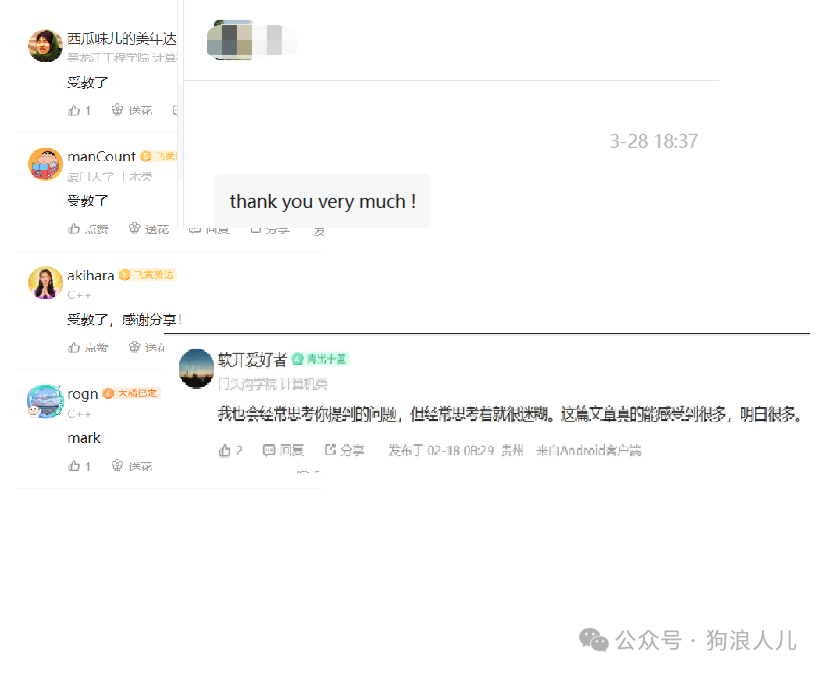
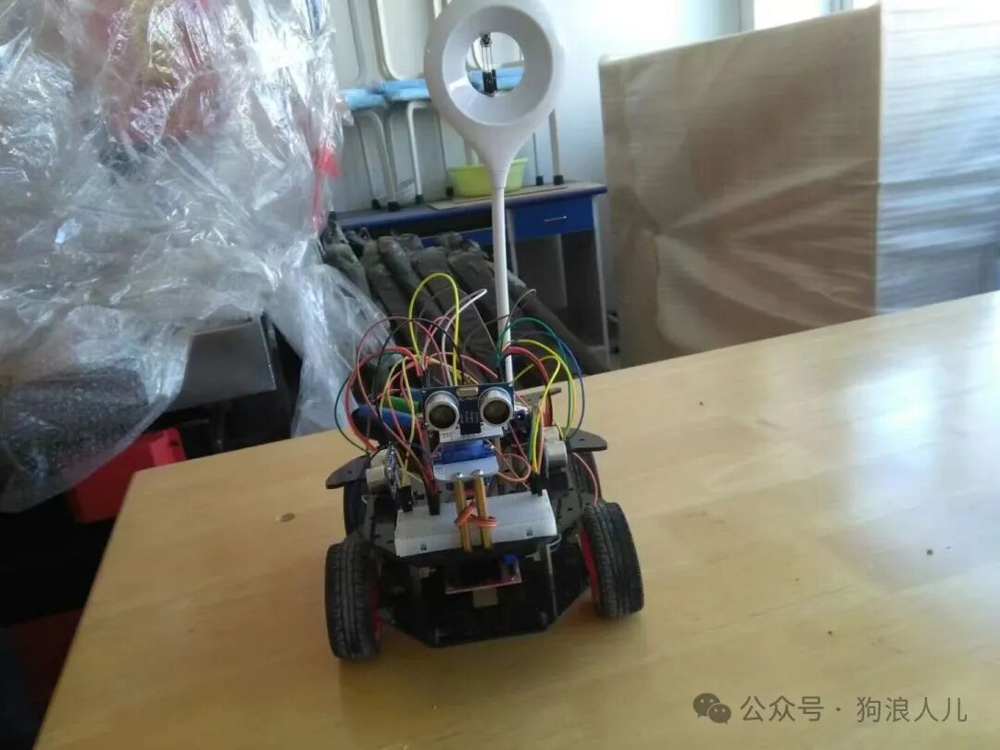
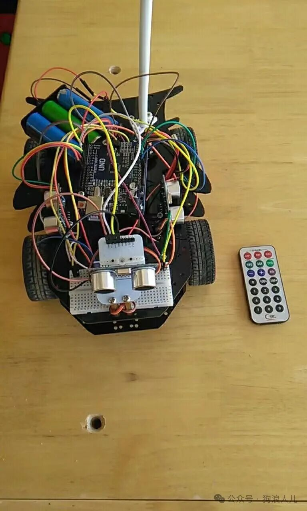
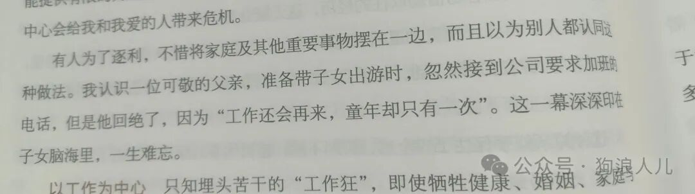
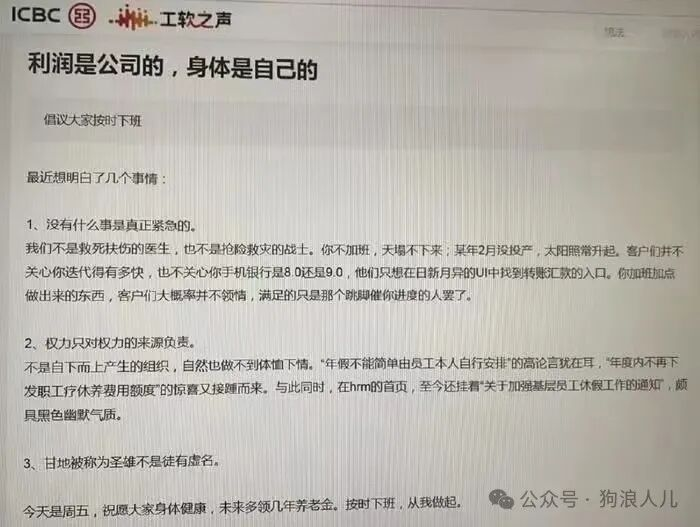
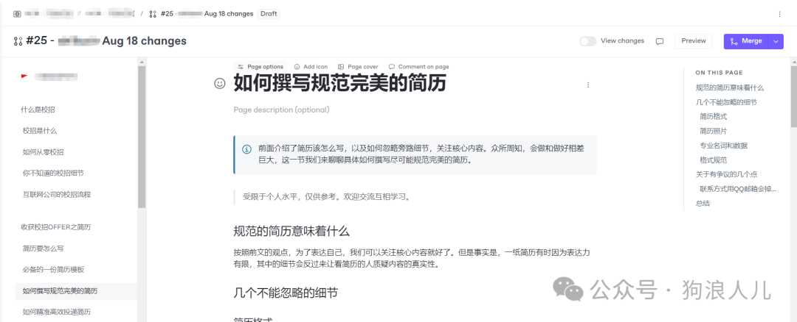
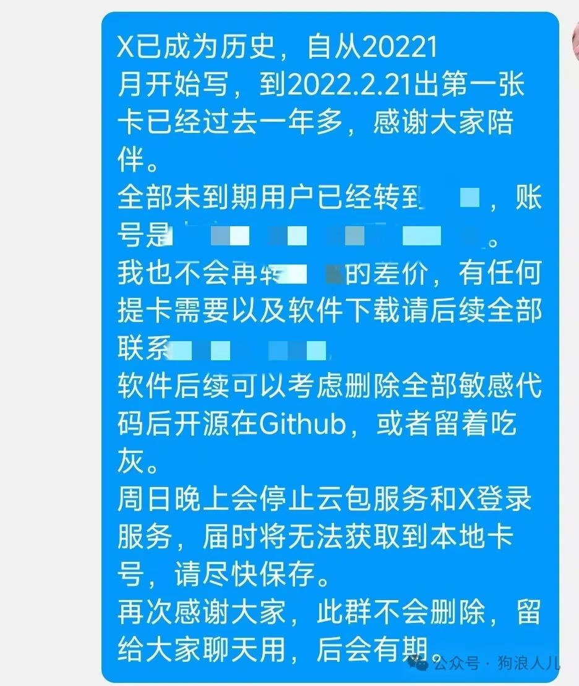
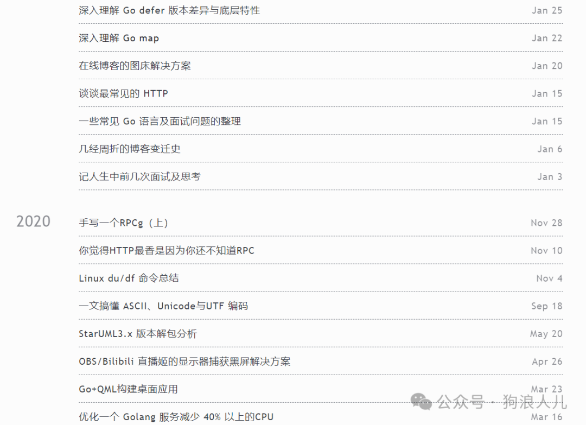

> 本文原载于我的微信公众号「狗浪人儿」，发布于 2024 年 8 月 18 日。[查看原文](https://mp.weixin.qq.com/s/fvDV5aAUBn2E4-y4BXPynw)。

好久不见，距离上一次发博客已经过去整整半年了，最近又收到了入职两周年的推送，再一次提醒我时光飞逝，不知不觉都过了25岁，不再是”职场萌新“了。

先感谢上一篇文章的关注者和读者们，当然也是非常感谢二哥（@沉默王二）的转发，博客在公众号和牛客都能有这么多人分享和点赞有点惊讶，看到99+也着实受宠若惊。

发现可以帮助到其他人，也很高兴。

这篇博客里写一些近半年的经历思考、书籍分享，还有一些副业的变动。

## 近况和思考

时间飞快，不知不觉已经工作两年，也25岁了。随着逐渐熟悉进入舒适区，平时有了更多时间跳出圈外去思考工作和生活。

正式“奔3”了，停下来想一想，2024是我觉得最有收获的一年，因为从来没有这么立体地思考过自己以及身边的事和物。

职场的经历正像那句歌词一样，逐渐磨平了我们的棱角。

曾经的记忆似乎总是零碎的，小区的花草、学校食堂三楼的盖浇饭，抑或是某本书上的一段话，都像一个笼子，罩住了我整整24年。

### 成长

成长有点抽象，也许凭空抬头想象很难发现过去一段时间自己到底收获了什么，时间飞逝这个词在最近感受越来越明显，在公司经常神情恍惚地自问时间，仿佛昨天就是周末，还在海边散步，可一眨眼就又到了周五。

我常常翻看曾经留痕的内容，比如博客、照片，经常有和当初不一样的感受，也许更多维度，切实地为自己真的在成长，会很开心。

以前太单纯，摆弄一些技术，眼里不可一世。最近两年接受的信息实在太多，也许只是对我的冲击有一些大。

抢地盘、人情世故、嫡系、站队，这些词汇一个接一个地闯进了我的世界，有些不知所措。

最近很久没有这种感受了，有的只是麻木，只在乎自己月底能拿到几块几毛钱。以前的那些个什么技术追求、什么个执着，统统都抛到脑后了。我实在不愿意相信人的变化能这么大，让我感到有一些恶心。

人真是社会化的激素动物，那些主观感受不过是一针管多巴胺还是巴比妥的事。

---

回头看高三时还在把玩arduino，放弃月考的自己，一时又觉得懊恼，也许把这个时间用来复习可以提高几十分。可是再想想，如果那时没有这样的经历，在高考6个学校6个专业都报计算机的情况下，最终依然差1分进入计算机专业时，也不会一年坚持两次转专业，以及有现在的我。

喏，选择没有对错，认准了就是对的。也实在没必要用过来人的眼光去批评曾经的自己，因为那时他也是个站在雾里的少年。

### 知足常乐

24岁很特殊，距离18岁和30岁都有6年。

很久之前我也一直不理解这个词，未步入社会的我实在乳臭未干，沉浸在自己的世界中无暇顾及这些，想当初卖一些编写的小玩意儿，可以实现早餐中喝汤自由就已经感觉十分幸福了。

恰巧最近有一点职业焦虑，联想到近些年的经历，不禁有些感慨。

人总在攀比。从小到大不是比成绩就是比钱，不是 隔壁家的孩子考了多少分，就是 七大姑八大姨家的孩子工作多么的体面、工资多么高，谁谁有了那么好看的最新款3C产品。不是外忧就是内扰。

最近又看到一些言论诸如 职业、晋升之类的话，让我又一阵目眩。

想当初没工作谈薪时，我心想 只要月薪3000元就足够了，那样一天就能100块，想想都好开心。工作后获得固定收入时，我心想 如果有个弹性收入，多少不重要，有增量就很快乐。后来副业收入也稳定了，开始思考什么时候副业超过主业\.\.\.

再后来，别人开始说怎么还不晋升，不晋升赶紧跑路吧，我不由得一阵焦虑，开始纠结什么时候能晋升，什么时候能涨薪30%。

突然我一怔，有点释然了，发现眼前有些模糊，似乎还有无数个“隐藏目标”：存款、买房、买车、结婚、有娃\.\.\.我赶紧手忙脚乱地低头看看存款余额，不由地松了一口气\.\.\.

我也一下子就理解了为什么说欲望是无穷无尽的。有一句老话：人教人，千言无果；事教人，一遍就成。

降低期望，如果整天担心会不会被裁员，失去这个那个，从而陷入内耗，实在不应该。保持独立思考，快乐、舒适是一个“绝对量”而不是“相对值”，学着给生活做预期减法，500万有500万的活法，5000同样也有。

### 关于35岁”退休“

这个问题被非业内人士都说道了好久，还包括“秃头”。思来想去有两个原因。

#### 产业结构过于简单。

因为发展较晚以及一些不可描述的缘故，国内计算机工业这个垂直圈子的发展没有太多沉淀。

但是互联网很繁荣，靠着直播躺赚，靠着外卖，在40度的夏天舒适地动动手指头就吃喝，实际上最终靠的是剥削部分人的劳动力，并不是生产力的提高。

大多互联网公司美其名曰是科技公司，实际上甚至连百分之一的利润都没有用来投资技术，为了业务，说白了眼里就只为了赚钱圈钱。

承德程序员、CSDN搬运、国产VSCode，突破底线的事层出不穷。大多数的“应用层科技公司”割着一茬又一茬的韭菜，昨天是移动互联网，今天是人工智能，明天又会是什么。

没有深层次的积累，造成了入行的门槛偏低，大家争相涌入”繁荣“的计算机行业，而这里的简单应用又不需要过多高层次人才，也许只需要“狼性”能加班能通宵的“小年轻”，太多的人最终被迫35岁转行。

许多人也许就为了想靠技术作为铁饭碗，想像医生、律师之类的传统行业一样吃长期饭。实在很难想象同样一个技术工种，靠积累吃饭的工程技术领域，会面临高龄就业问题，听起来就非常奇怪，<strong>难不成70岁工程经验丰富、系统架构熟练的老头设计的系统比20多岁的人差？</strong>

毕竟高龄高职级的管理型人在少数，太多一线的工程师们并没有什么选择。

如果大家都在开发学生管理系统，那确实不需要这些了，其实这个问题不用解释，海外的高龄工程师们已经证明过了。

#### 人员竞争过于激烈

慢慢发现计算机行业的现状不全是岗位本身的问题，如果换成厨师，面对如此高压的竞争环境，依然会造成这个局面。

互联网行业表象的繁荣：高额的薪水、美好的前景、混乱的行情，这些相加导致的就业人数陡增，几乎必然会导致内卷，争相抢夺固定的资源，这换在任何一个行业都会这样。

<strong>门槛和深度还是太重要了</strong>，也许大家以及彼此的父辈们都知道医生、律师等等职业很不错，但是至今没有和计算机现在一样的情况，我想仅仅是医生本科5年+高门槛劝退以及高龄的职业纵深就能说明这一点。

> 劝人学医，天打雷劈。到了计算机这里就变成了，高考不学计算机，难道去学土木？

低门槛下，激烈的竞争反过来又会加剧35岁的职业压力，在有限的岗位以及大量的竞争中，找工作生存下去都成了问题，创新、发展就更难，<strong>俗话说的好，吃饱了才能撑着想其他事情、有其他烦恼和解决一些存在的难题，饿着就只有吃饱这一个目标</strong>。

原本创新的诞生是这样的：

1. 遇到问题 -> 寻找解决方案、无果 -> 试图创新 -> 尝试推行1.0版本 -> 最终完善到完美

但是35岁后的创新是这样的：

1. 遇到问题 -> 寻找解决方案、无果 -> 随便糊弄一下，赶紧下班得了

思来想去，过去和现在又有什么差别呢。那时候会英语、熟练使用电脑就是人才，那个需要控制电传打字机的写字头先换行再回车的时代，还有现在这个用着 Chatgpt，以为自己确实有足够的能力理应获得个税比父母辈月薪都高的报酬的时代，又有什么差别呢。都会随着时代洪流，就像百度也搜不到2000年前后的历史一样，成为一代人的体验，永远的结束了。

觉得我们一部分人是幸运的，同时也是悲催的。

悲催在这个总资源量不变的情况下，凭借着高考和专业侥幸赢得了一些内卷的资格，回头又感叹计算机从业者的“痛苦”，无疑是有点无病呻吟，得便宜卖乖。

也实在没觉得几块钱买走别人在40度的夏天为我跑腿的劳动力是理所应当的福利，快乐就像能量一样是守恒的，这些生产力也是固定的。

翻来覆去，实在是难说。

### 职业这碗饭

#### “防御性”编程

“防御性编程”本来是一个好事，一般指防御式设计的一种具体体现，它是为了保证，对程序的不可预见的使用，不会造成程序功能上的损坏。

可是业内有一个流行的说法，程序员为了不被裁员，故意把代码或者系统设计地不容易维护，以此巩固自己的“护城河”，从而“要挟”老板。

听起来有点好笑，但是身在其中的人也许又感同身受。

这个做法在稍大点的公司一般用处不大，组长或者是负责人在地盘、嫡系等等职场江湖纷争中一般不会顾及一线业务的状况。

最终实际上，屎山的代码或者设计，到头来只能恶心下一位接手的一线程序员，并不能为自己建立任何护城河。

一线程序员就像干电池，在派系间逐渐麻木、疲于奔命，最终在35这个槛上，爬不上去就被新的干电池汰换。

大部分情况下技术确实没那么重要，反而业务、站队，或者说，钱、运气。

#### 工程师

最近对这三个字觉得有点迷茫，或许是因为漫天飞的软件工程师实在是太多了，又或者是感觉更像一块“砖”，在人人都可以随时被替代的位置上被搬来搬去，更别谈归属感了。

最近经历了第一次工作的被动交接，感慨颇多。

有时候有点恍惚，想着这碗青春饭，虽说打着技术的幌子，实在不至于过的如此艰难，甚至担忧未来的饭碗。

也许就像身边大哥所说的，想安安静静地沉淀一些技术，写写代码到退休，实在是一件奢望的事。

最近上班路上经过施工的工地，感觉场地中的白帽子工程师形象高大了许多，也莫名其妙。

#### 认清自己

字节有8亿日活的国民级产品，腾讯有现象级的产品“微信”，更是有收入令人乍舌的王者荣耀，但QQ游戏里，页游排行榜里也有某个不知名角落的一个冷清按钮，也有对应负责的研发团队，他们都属于腾讯。

与其相比更重要的是跳出业务，沉淀自己是最近感受比较深的事。

工作会陷入局部业务的一亩三分地，今天在做方向A，过段时间又被搬到方向B、方向C，砖头总被搬来搬去，但不变的是人。

其实在这么垂直的一亩三分地上，做着随时可以被替代的工作，大多数实在没什么沉淀和积累。

多少风光一时的技术和产品都会随着时代被淘汰，更别说是边缘中的边缘圈子里的人，还是应该多跳出面前这个圈，抛弃框架和软硬件，做深入思考，<strong>着重在核心竞争力上</strong>。

35岁转行卖鸡蛋饼也许还真不是一句戏言。

## 杂项

### 音乐

最近常常单曲循环，尤其开始在看书和写东西之前需要听歌让自己平静下来，一般会小声地单曲循环一些节奏均匀、平静的BGM进入状态。

有天下午突然想听童话镇，虽然我很早就知道了作者的经历，但是在搜索一大通最终也没有找到在线版本，有点惊讶。

于是我下载了离线版本，导入后边听边想，同时感慨一个人怎能消失地如此彻底，纯洁的旋律、雪白的艺术或者上下跳动的音符究竟有什么错。

### 在互联网上冲浪

个人感觉网上冲浪虽然大部分时候学不到东西，但还是有意义的，一来可以看看林子有多大、增长见识，也可以紧跟“潮流”。

1. 浏览GFW的仓库时看到作者提到新疆原来不能使用百度网盘，之前听说那里菜刀需要有身份证，汽车需要定位，集体物理强制学习一些知识，这下扩展也去了解后发现原来这里的网络手段的管控比想象中的更严格，相当于在局域网GFW下又做了严格的城域网。
2. 还有一件令我等萌新震惊的事，一位黑客为了实现对一个通用压缩软件（xz，相当于winrar）注入病毒，提前三年作为开发者不断为该软件开源仓库贡献，直到骗取作者信任，在作者生病让他放手去做的时候，在大量的有效提交内，提前上传伪装为测试数据的压缩文件，再通过加入一个 ”.“ 符号让编译脚本报错跳过沙箱验证，再结合二进制测试文件替换注入病毒代码，手段隐蔽，即使逐行阅读代码也未必能发现。

这个供应链的漏洞可以让大量的下游服务器受到影响，甚至差点合并进入官方系统的发行版中，约等于往人人都吃的大米饭里下毒。

最终是一名微软程序员发现自己的sshd程序的cpu占用有点异常，甚至ssh登录耗时超过了0.5秒才逐渐查出漏洞并公之于众。

让我等一众萌新不禁感慨，连黑客都这么有耐心和毅力，这年头真是做啥事都不容易了，让人鸭梨山大。

1. 说到压力大，不得不感慨最近发现连公司食堂工作的姐姐都需要加几百上千个同事，担心被领导看到群里反馈的差评，就挨个私聊套近乎甚至要好评，节假日还要强制穿超短裙。实在是行行不容易。
2. 越来越抗拒学习新的编程语言，说好听点是”语言是一种工具，有一门趁手的就够用了"，难听点就是“被舒适区的重力拖着，懒”。

最近想系统性地学习一下 python，好久没有完整看过一些技术内容了。

### 定期输出

之前也是答应了二哥做一些校招方面的内容，还是高估了自己的时间安排，以及在这件事上自驱力不够，拖拖拉拉到现在还没写完。

从这篇内容起，终于是下定决心把这个系列尽快完成了。每周固定抽时间单独在这篇内容上面。

希望分享一些经验，尽可能让大家少走弯路，踩无意义的坑。

## 近期书籍分享

近期看了一些书，仔细想想，自两年前拿到毕业证，已经两年没看过书了。

之前都是看大部头的专业书，突然发现”细糠“也不错，但是也不能太“细”。在这里分享看过的几本书。

大致有这几本：

1. 高效能人士的七个习惯（怎么积极向上）
2. 代码整洁之道（看大佬的一生）
3. 人月神话（人天/人月的意思，项目管理）
4. 凤凰架构
5. 数据密集型应用系统设计
6. 围城（受不了）
7. 朝花夕拾（受不了+1）

### 代码整洁之道

这本书是第一人称自述了从什么都不会到成为大牛的过程，从最开始的用电传打字机，录入纸带编程，将代码”推“到用户手中（一些纸带，通过某个手段推到用户手中），了解演化过程，看看大牛的自述发现大牛也是从被嫌弃的小虾一步一步最终成为大牛，这个过程还是很有趣，也对认知有很大意义。

俯瞰别人的一生，这种感觉很奇妙，我们可以发现其实大部分问题别人早就已经遇到，大部分人的发展路径没什么不同，可以很好的纠正职业观、价值观，认识发展规律，从而避免成长路上一些错误或者是不应该的心态，

特别结合身边工作的实际体验，关于书中作者对于工程师的职业素养的观点让我收获颇多。

书中给我印象最深的一句话就是：我不应该在办公室做一个小时和工作无关的事，要努力交付承诺的项目（大致意思）。也许有一些严苛，可至少，我觉得工程师的素养，或者是所有职业人的素养都应该是 <strong>认真负责，承诺必达，保质保量。</strong>

我认为这不是针对哪一方的规定，也不想谈论办公室政治，摸鱼划水等等问题，而是就事论事，抛开现实，这是份内的事情。就像公司付费，员工出力一样理所应当。

同样的，公司不对员工的成长和可持续性发展负责，因为简单的付费/出力的雇佣关系也不应该包含这些。

这本书我愿意把他称为计算机从业者的必读作，强烈建议通读，整体文笔清晰简洁，目录清晰，尤其是作者开篇一句：我写了40多年的程序，就非常令人震惊。

### 朝花夕拾 && 围城

不知道是不是被计算机的毒侵入骨髓，曾经的我喜欢背诵名家的名句，以创造出优美辞藻为荣，拿出来大用特用，在作文中当作点睛之笔。可当我再次翻开文人大作，竟然有一种受不了的冲动，满脑子都是：

”写了那么多到底想说啥“

”废话真多，明明两句话能说清楚非写那么多“

也实在受不了围城开篇中所写的 “它给太阳拥抱住了，实在分不出身来，也许是给太阳陶醉了”，实在不想为自己贴标签，可是潜移默化的力量还是很无力的。

长期接触固定的输入输出模式，给了参数就必须有回应的习惯性思维，被迫接受其实也很痛苦。虽然很想‘落霞与孤鹜齐飞’，但是天天if else真的只能写出‘鸟飞过去了，太阳要落山了’。

但是朝花夕拾相对好一些，迅哥儿的语言没那么花哨，加上散文的缘故，还是坚持读完了。不得不说书名是还是很贴切的，表达了回忆小时候时光的感慨。

也许以后要再费劲“掰弯”，目前这些书要费力地啃一段时间了。

目前进度：3页。

### 凤凰架构 & 数据密集型应用系统设计

属于工程类大部头书，比较系统、完整的认识软件架构和设计过程中需要的各种问题，阅读需要有一定基础。

适合慢读，比较全面，不太适合公众号之类的短文速读场景，这类作者工程和技术能力足够，几乎任何人读过都能有所收获。

建议长期细读，慢慢理解吸收。

1. 给奔跑中的汽车换轮胎本身就不合理，一些技术和业务诉求应该果断拒绝，例如重启四分之一个程序。
2. 表示团队人数的两个披萨概念，6-12人。团队规模决定了解决方案，解决沃尔玛和楼下小卖部不是同一个问题。
3. 分布式和单体应用的区别，优缺点，自治与隔离。远程调用需要考虑的许多问题。
4. 云原生时代。软硬一体解决架构问题。
5. 发展进程：单体，soa，微服务，后微服务（云原生、sidecar），无服务。学习演进历史的意义
6. 学习的正常思路是先把汽车运行，体验一下，而不是上来就研究变速箱构造，引擎动力原理。

### 高效能人士的七个习惯

非常经典的“鸡汤文”，不过还是十分值得阅读。

我现在觉得与其会几个知识点，背一些公式概念，不如学习思维，不是谁生下来都会背诵马克思原理，有一个良好的思维也许更重要。

1. 以终为始
2. 积极主动
3. 要事第一
4. 双赢思维
5. 知彼解己
6. 统合综效
7. 不断更新

嗯，看目录就很鸡汤。

## 技术变现

最近主动放弃了我的副业，打算从头开始。

副业还是有点难的，目前除了割韭菜、自媒体，其余的大部分副业确实很小众，对于技术开发者来说，路子就更窄了。

思来想去，副业分为有技术向和非技术向，例如近期利用chatgpt官方接口二开卖公共账号，打造技术自媒体IP，写一些内容分享，解答一些职业问题等等。再或者，用大模型智能生成图文跑流量、发一些炫酷视频贴教程收割小白，等等。

大部分盈利变现还是靠的广告、知识付费。压根用不到什么强大的代码技术功底。有许多钱不靠技术来赚，首先还是要认清这一点。

技术实现中代码变现的关键在于如何找到痛点，大部分的技术变现没有太多技术含量，也许只是针对性地解决了一些很简单的垂直类问题。

对于我个人来说，还是想尝试非技术向的副业，但是对于我来说感觉难度更大，实在不行也只能继续看看技术相关的了。

如果有选择的话，还是最好有一些可持续的和技术相关的副业，既可以培养职业兴趣、又可以带来长久的小收入。

## 个人博客的未来

最近在 Github 上冲浪的时候又发现了我的博客，之前买的域名到期了，就一直在使用免费三级域名。

上班的时候阿里云客服打电话提醒我OSS要到期了，我才意识到目前还有博客在用这个OSS当图床，在纠结要不要续费。

目前移动互联网依然很受欢迎，曾经大家热衷搭建独立的PC站点、愿意购买简洁直观的域名，现在也有点”过时“。

而且维护这些的成本越来越高，平台化大一统趋势越来不可阻止。

未来打算在公众号上开一些子目录，分开记录技术向博客以及日常的内容，算是当成免费的内容场地了，也省得去维护博客仓库、域名、图床等等琐事。

在工作两年的这个节点上，也好久没有关注技术了，趁着抛弃个人域名的契机，未来打算持续更新一些技术向内容，

尽量精简，<strong>增加频率，保持热情</strong>。

比如开发者如何和不怀好意的破解者斗智斗勇、中文编程语言易语言等等。

一些早期写过的内容

## 写在最后

希望我们遇到事情总能跳出圈外，独立思考，假如被裁了就想想人生还有那么长，或者有时候累了就停下来歇歇、换个赛道。

看清自己真的很重要，人经常忘乎所以、贪得无厌，也很容易”当局者迷“。

其实有时候只是我们运气好，事情也总是有得必有失。

与大家共勉。
