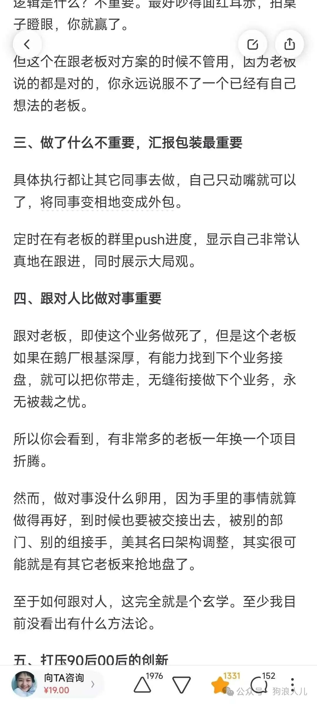
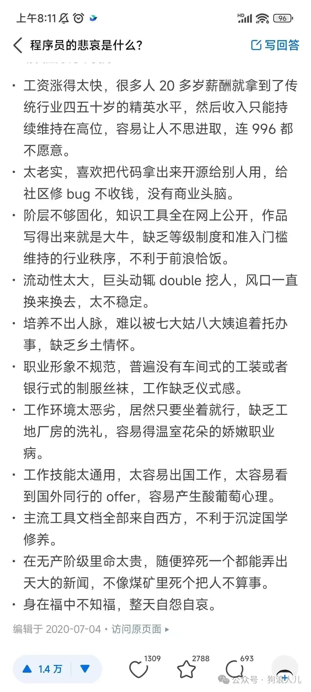

> 本文原载于我的微信公众号「狗浪人儿」，发布于 2025 年 4 月 6 日。[查看原文](https://mp.weixin.qq.com/s/juI6PvbZmu6iI4SX-Z7sWQ)。

好久没更新了，上一次更新早在去年8月了，也不知不觉工作两年半了。

想到和我一届的同学如果读了研究生，今年也该毕业了，我也快工作三年了。

这篇分享点和技术无关的内容，一篇随笔，希望对大家有帮助。

## 工作和职场

去年9月经历了第一次工作的被动交接，感触颇多，我也把这个时间作为我工作的第一个里程碑。

<strong>太多工作不值得用心投入</strong>，这是扑面而来的感受。

很多人都纯粹过，可30岁以上还在做业务的研发却很少还能保持热情。我曾经折腾折腾arduino，研究研究plan9，看看网安，工作了想着怎么用技术保障好业务，做好监控、监控、容灾，这些经历也够唏嘘好久。

但终有一天被当成工具丢来丢去的时候，也同样明白了没人会在乎别人的感受，疲于奔命，逐渐麻木算是太多人工作状态的最好诠释。

一直纳闷为什么一个技术岗位，搭着别人口中那些看起来高大上的程序系统，会沦落到迈不过去<strong>35岁的这个最不应该的坎</strong>。

职业前期被当成所谓的”资源“被挪来挪去，成为名副其实的”耗材“，如今沦落到爬不到管理就要被干掉的程度，实在可笑。爬上去了，再做好向上管理，向上画饼，向下抽鞭子，成为所谓的精英”人才“。

说到底老老实实做技术是不被允许的，年纪大的IC（Individual Contributor）是不被广泛接受的，用我们领导的话来说就是：程序员做需求是最基本的要求，如果你只做好功能，那么我为什么不招一个外包呢。

也没说错，还是技术工作太简单了，最后呢一来重视年龄，二来内卷非技术工作内容，写文档，做汇报，牵引产品。还是应该对程序员祛魅，或者说应该对国内大部分程序员祛魅，成功地把岗位变成了一个靠年龄的耗材工作。

或者说是技术一文不值，一些报错、告警、吐槽，只要没被上面的领导进群看到，一律无视，反正又不影响自己向上汇报包装数据拿绩效。

那么什么重要呢。

除了上面说的那些内卷项目，又回到人情世故上，跟对人也许更重要，目睹一个同事3个月内换3个岗位，直属领导去哪里后，紧接着一周后就转岗。似乎做什么不重要，跟对人，绩效下限有保障，不会被被刺，工作容错就高。如果项目搞砸，可以迅速跟着领导换项目跑路，继续循环画饼/汇报/碰运气，换项目。

至于如何成为嫡系，除了技术能力，就等同于如何取得信任。随意跳槽和内部转岗这种肯定是要从零开始培养的，信任也是要慢慢累计的，假如技术不那么重要，大家都搭建学生管理系统，想靠技术证明能力再配合忠诚组成信任没那么容易了。

## 公司和业务

吃了最近某公司高管的瓜，饭后散步和同事大哥聊到为什么字节跳动做不好大模型，观点出奇的一致。

抖音的钱来得太快了，导致公司快速成为了一个“暴发户”，因此深刻地认为任何的成功都是可以靠”人“硬堆出来，不太相信长期投入，只认短期数据，希望快速短期砸钱、一波没拿到结果立刻撤退。在任何行业都是如此惯性，游戏、大模型，做了太多APP，最终成为了“宇宙工厂”。

从上而下的压力会均匀地分散到所有员工，太多员工几个月一调整，被当成所谓的”资源“被搬来搬去，被迫短视，不需要再考虑短期方案/长期方案，6个月后都不一定是自己负责，不会有人会在乎这些。不过我们依然可以安慰自己，这是我的精神洁癖，写的漂亮自己看得舒服，那些设计模式、工程架构更是狠狠满足了年轻的技术追求。

把员工翻译成人力资源，最后简称资源真是太合适不过了，人工红利可以说被诠释的淋漓尽致。

职场太复杂，也许最终也避不开人。负责人的地盘斗争，派系站队，成为嫡系拥有无限的容错，亲身经历汇报斗争失败几十上百人一起被干掉。组织规模越大越突出，不汇报、只埋头苦干做脏活累活最终只能成为最好用的“大头兵”。

我迷茫了一段时间试着辩解，可最终发现这一切对我来说也许真算得上是一件好事。最后决定把重心放在自己身上，这是经历这件事之后我最宝贵的经验。也让我从另一个角度更深刻地理解了 2020 年公司高层allhands中的某次主题 “成长是自己的事”。

重心放在自己，大部分业务，或者说团队不值得太多付出，

> 领导：我们按照XXXX来做
>
> 群：\.\.\.\.\.\.
>
> 同事A：这样会XXX，大家怎么处理YYYY类事情?
>
> 领导及其他人：\.\.\.\.\.\.

放在之前、也许就几年前，我肯定会站出来说大家不敢说的质疑，去讨论必要性、可行性，在我从前的认知里，没什么不能沟通的，这些沟通就应该和技术本身一样，<strong>保持纯粹，就事论事，如果不合理，就应该被拒绝</strong>。

也许真如那样所说的，每一个人都要经历心态的变化，从毕业时的纯粹、热血至此，逃不掉的。

## 人为财死，鸟为食亡

之前专注学习、工作上的事，有点人菜瘾大，最近从这些事上跳出来之后，更关注其他方面了。

一来喜欢跟快要离职的同事聊感受，我觉得这是很宝贵的财富，未来也要经历的事情，二是

码农这个职业跟国内人情世故的社会可谓是”背道而驰“。大家都靠着所谓关系走后半程，唯独码农只会对着电脑折腾所谓技术，也逐渐理解了领导为什么会技术这么不屑，在业务和钱面前，保住饭碗变成了最重要的事，“我们就赚钱就好了”，也无可厚非。

上面提到的35岁需要爬到管理岗，”管理“这两个字实在复杂，大学的时候听老师提过一个问题，

管理知识越丰富的人成本高，还是只会出力的人更难？

答案是前者。

怎么合理管理下面每个人的预期，让大家保持稳定，即使给了差结果依然欣然接受，一张一弛之间，就是所谓的中层管理。抽的狠了会把驴抽走，抽的轻了驴会偷懒，除了向上管理，怎么向下蒙住驴们的眼睛的同时，给驴希望，防止驴躺下，是门技术。

要不不是说，怎么看最近谁绩效好，除了嫡系看看最近谁打鸡血。

实在突出“人为财死，鸟为食亡”，也确实无可厚非。

## 初衷

坚持做自己喜欢的事，确实称得上“浪漫”，但在工作之后很难。

最近特别喜欢一个词“保持初心”。用站着说话不腰疼的语气来说就是，我们经历了很多，成长了很多，最终认清了现实，但是希望彼此回到起点，仔细全方位地看看那时的我们，不为了去解释什么，就是为了说服自己。

钱很香，没错。
