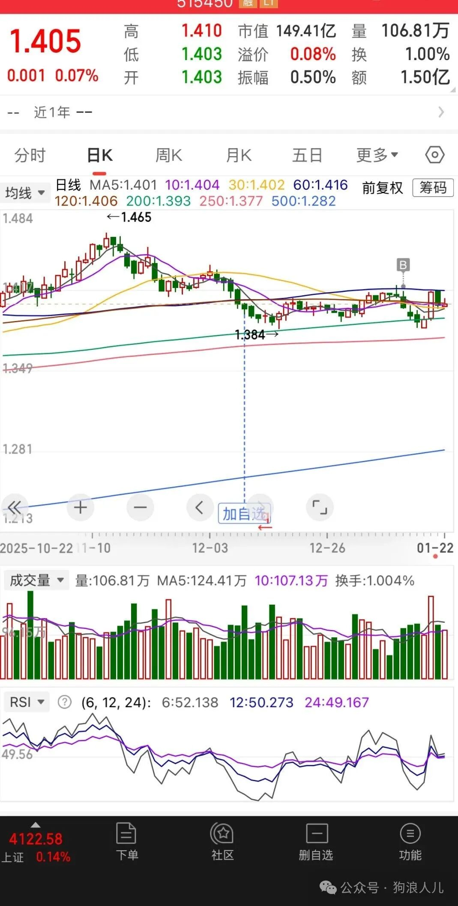
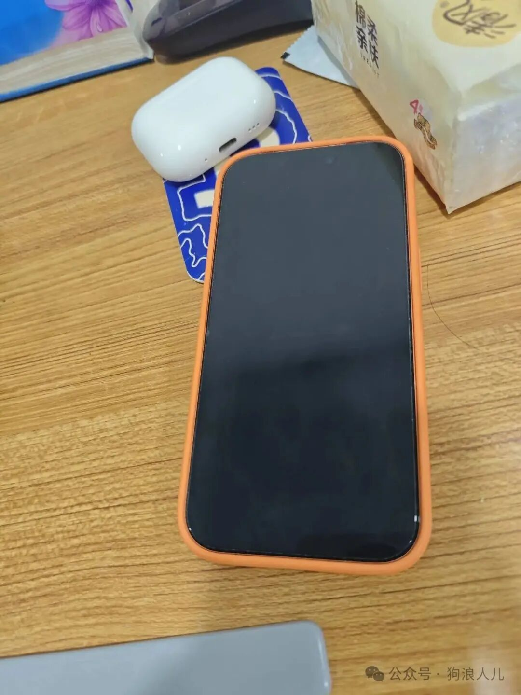
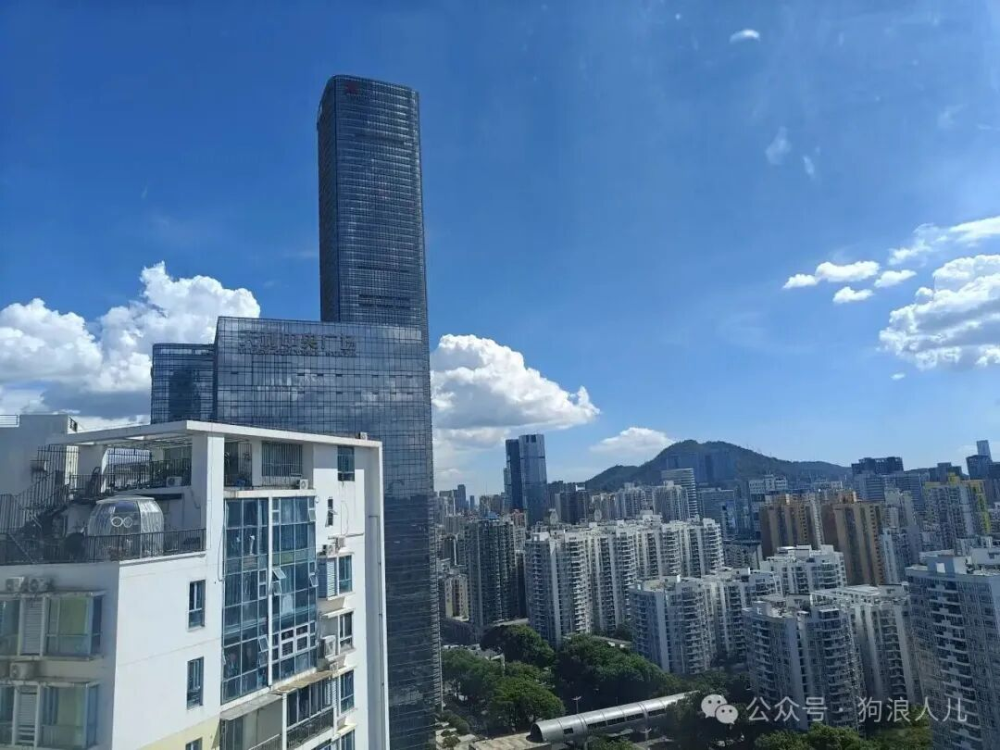

> 本文原载于我的微信公众号「狗浪人儿」，发布于 2026 年 1 月 23 日。[查看原文](https://mp.weixin.qq.com/s/VQ--ojYJLozsSa5wxVL-0A)。

好久没写公众号了，上一篇发布在2025年4月，算是名副其实的“半年更”公众号，关注人数不出意外稳步下降，但竟然没有想象中的多。

2025是一个分界线，因为我本科毕业工作刚满3年，而那些选择读研的同学也毕业开始工作，曾经“3年工作经验 VS 3年读研”的问题，我已经从当初的提问者变成回答者了。

今年存款没有太多变化，并没有像去年增加一位数那么兴奋，<strong>但今年成长和收获却很大，大到比过去25年的总和都要多。</strong>

<strong>经历的太多很痛苦，只希望2025快点过去</strong>，距离过年还有不到1个月，嗯20天。

头绪很乱，多担待。

## 同事离职和过世

近期有一个校招同事入职不久吐槽，也有一个刚毕业两年的校招同事离职，去年初也有一个工作刚几年不到30岁的同事离职回老家当老师

其实大家的工资都属于佼佼者行列，搭配上字节跳动、Tiktok Shop、计算机硕士/名校，这么多的光环，放在我们河南省大部分家庭里，分分钟都是别人家里的孩子。

我猜年薪至少也都在40W往上了，无论怎么说都应该珍惜、努力才对，可结局呢

## 期望越大失望越大

有时候做事真没那么纯粹，互联网、或者说除了研究员类型都是这样，无一例外。

哪里都是老板一言堂，没有人关心无法写为绩效的技术优化，不会陪老板喝酒套话可能连入职landing都活不过去

<strong>带着期望与憧憬终会在频繁组织调整，满足不同老板的晋升汇报诉求、每个人都站起来喝酒打圈、笑脸奉承只为了要一个绩效互评M+中失望与麻木。</strong>

<strong>我相信，所有人无一例外。</strong>

## 心累比996都痛苦

校招新人问我：他再选择一次，可能不会奔着钱，选择现在这个offer

我回，如果你当初信息差不变，那么再选一次结局并不会改变。

我们希望做的事有价值、有盼头，这和是否成为螺丝钉无关，背后意味着所在的业务的发展是向上的

一旦业务向下走，那么高层的压力会均匀传递到下面的每一个人

正所谓压力大了动作就会变形，急功近利的结果是所有人为了结果、为了指标哪怕不惜欺骗上级换取绩效。

A/B实验的结果不好就换个指标、换个口径，只要定语足够多那么实验结论一定正向。

这时技术团队就像头上时刻悬着达摩克里斯之剑，老板为了保命更拼了命的汇报总结做PPT，努力却无意义、恶性循环。

<strong>可技术团队老板又能如何影响业务呢，那这是为了什么呢，不过是为了保住年薪200万的饭碗罢了。</strong>

<strong>为了钱、不寒掺。</strong>

<strong>换做你我呢，会做出什么选择？</strong>

## 嫡系文化

最近越来越感觉 “信任” 这两个字是职场打工的最终词条。

抱着大腿，一切似乎都有了保障。

别人说的坏话，在嫡系的眼里这就是递给他自己的刀子

年尾的绩效，在年初分活的时候其实就已经定好了

业务垮了，嫡系跟着老板已经换到了新业务

有好活好业务，嫡系已经开始渗透慢慢接手、直到完全汰换

有嫡系这层，即使再差绩效也有保证不至于背M-，毕竟分活时就可以挑去脏活累活，这谁还不能有产出呢。

<strong>哎，这些花里胡哨在嫡系面前都是小丑，你我又何必呢</strong>

## 理财元年

抛开工作，今年正式开始了理财，从场外支付宝再到最近跟风开通的场内券商账号，草草学习了一些理财知识，也打算跟投一些国内外宽基指数。

赚固定工资会产生“数字幻觉”（我编的概念）：存款在很少的时候会产生明显积累，因为成长百分比较大，如每月1块 -> 2块是翻倍，但100块 -> 101块却仅是1%，赚1%却是1万。

至于风险是另外一个问题，不过我觉得原则也非常简单清晰，就一条：

人不会赚到认知以外的钱，不懂的东西不要碰，交给专业的人去做

这也是我为什么从宽基指数开始。

上面这个例子是让我投资的直接原因，而根本原因我想来是同事大哥的随口质疑：

<strong>是不是你兜里的钱没地方花了。</strong>

<strong>嗯，好像确实是这样。</strong>

由于近期是牛市，我也警告自己冷静思考，避免踩风口赚钱却认为是自己的实力。

不管怎么样，投资算是开始了，打算从etf基金开始，暂时不碰个股，虽然某人工智能翻了几十倍、成为千万亿万富翁近在眼前，但目前的确与我无关。

后续也可以考虑更新我的实盘，这也许是这个号的新方向。

## 码农的职场

想写的有很多，可想来想去又感觉都是没用的知识，可什么是有用的知识呢，靠炒股到财富自由是吗，靠学识年入百万千万是吗，靠到处赚信息差是吗。

以前总是想着，是游戏研发岗位好还是互联网更好，是中台好还是业务好，<strong>手搓xx手搓yy，搓天搓地，恨不得从沙子开始手搓计算机。</strong>

在编辑公众号文章时写下了很多职场中我人肉踩雷的保命技巧，回读又觉得很反胃，全部删掉了

工作很累，千万别和自己过不去

思来想去总结一句话，权力只向权力的来源负责，即所谓“面向老板编程”

<strong>就像公司食堂的北极星指标是员工好评率，一边是让利把控原材料，努力做好菜，一边是买点礼物遇到差评就送礼加wx拉关系，雇水军在大群发好评给老板看。后者能让食堂变成好评全国蝉联第一、绩效拉满</strong>

<strong>在座各位干不干</strong>

## iphone+airpods

看到同事大多都使用的苹果，加上我从来没买过苹果，就去香港澳门溜达了一圈，顺便买了一部港版iphone17 pro，万把块

我用的第一个苹果产品是公司发的macbook pro，虽说高配，但没感觉跟我用了十多年的windows有什么区别，甚至相比我十几年前使用的1g内存的大头电脑也没有太多生产力提升。

手机也是这样，虽说安全、标准化，不过实话说对普通人没什么区别。

<strong>没必要凭空创造需求，普通人不需要绝对安全</strong>，wx监控/输入法监控/截屏/相册监控/内置反诈自带root权限等等也实在无所谓。<strong>用着国内运营商、国产软件、国产支付，实在谈不上什么所谓安全。</strong>

如果实在说优点，不那么流氓、<strong>对于认知不那么丰富的群体如我爸妈更合适。我是没精力让他们折腾开屏广告、注意诈骗、还有质量品控等等问题</strong>

不过第一次用air pods目前是0黑点，唯一的略贵那是汇率的问题不算黑点，毕竟不是你我的问题。那其实iphone也没有黑点，毕竟只是千元机。

贵贱都是相对的，没有对比就没有伤害。

作为普通消费者还是性价比优先，我也买过国产某些千元耳机、实在难评。苹果索尼优势也许不明显很平常，但是国内部分竞品实在太抽象。

## 公众号后续

一眨眼毕业几年了，关于校招的东西没啥写的了，而且地狱难度的背景，我感觉我回去都不行，只能家里蹲了，也没资格写了。

以后看看能不能换个话题，比如更新投资相关，我还买了一些投资的书籍，期待一波。

最后夸一下深圳的好天气以及10个月短袖的温度，哪天离职了我也愿意继续呆深圳一段时间。

祝大家工作顺利，事事顺心

