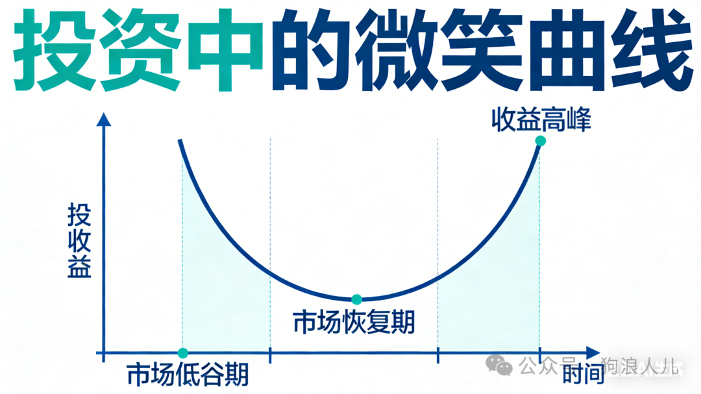
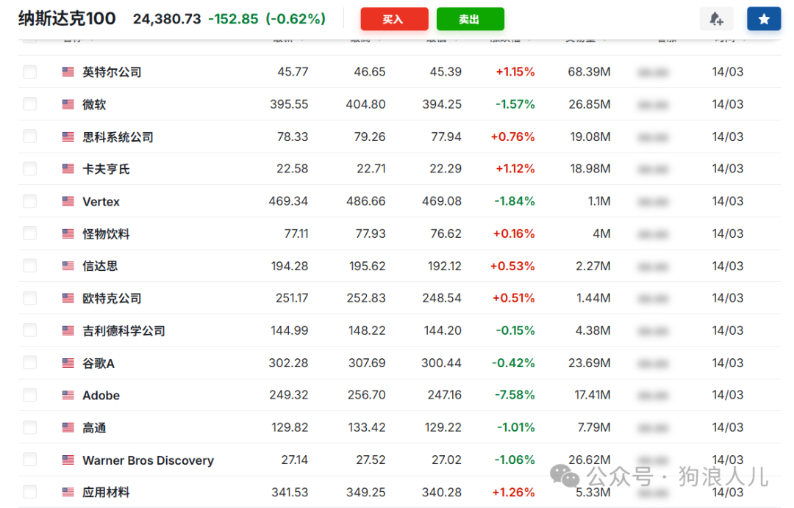

> 本文原载于我的微信公众号「狗浪人儿」，发布于 2026 年 3 月 16 日。[查看原文](https://mp.weixin.qq.com/s/rRwAs98kOyTrr_UV9f23pg)。

之前几年一直围绕校招/职场在写观点和反思，这次新开一个主题，填上篇博客里的坑：写写投资，分享我的见解。

往期文章移步这里：

- [2025是我26岁人生收获最多的一年](https://mp.weixin.qq.com/s?__biz=MzA5NjM3NzcwNA==&mid=2247485200&idx=1&sn=3fed2d385c64dcd98b7598b894eeffa5&scene=21#wechat_redirect)
- [本科校招毕业两年攒100w之后我还收获了什么](https://mp.weixin.qq.com/s?__biz=MzA5NjM3NzcwNA==&mid=2247485184&idx=1&sn=dfc744036ea877df0af409765e3543aa&scene=21#wechat_redirect)

内容有几个大类：<u>为什么要投资，哪些人适合投资和我的投资心得。</u>

## 一、为什么要投资？

上一篇博客中提到：

1. 1 万块存款即使年收益 50% 也才只有 5k，但是 <strong>1000万 的年收益1% 就有 10 万。</strong>
2. 工资 1 万每月，刚开始几个月的存款会以 100%->50%->33% 的涨幅增加，<strong>当累计到 100w 时增加幅度仅有 1%。</strong>

通过这个简单的算数，结论昭然若揭，所以有人调侃几千元投资的收益不如晚上不吃一顿饭或者美团发的优惠券膨胀一次，话糙理不糙、也有一定道理。

### 所以为什么要投资？

一句话表述：<u>为了更好的钱生钱</u>。

说好听点，叫死工资的增长速度太慢、有追求

说难听点，叫贪，不知足。

什么事儿都能正反着换一百种方式说，视角不同而已，**最重要的是认知**。

## 二、我的投资心得

尽量不要一上来就讲资产配置，因为在不懂的情况下这属于抄作业，不仅拿不住，而且会吃大亏。

因为：

1. 收益和风险共存，想明白底层逻辑，永远不要二极管思维。
2. 很多人买卖其实**不是投资而是投机**。
3. 人只能赚到自己认知内的钱。

**重点一，年化和风险**

这是我认为**投资最重要的事没有之一**，许多人实际上是在拿自己的钱开玩笑，见到黄金/白酒/消费/创新药涨就一股脑冲进去然后被套。

不是说它不涨，10年后涨也算涨，**时间成本也是成本**，不要动不动就是三十年后看收益。

投资第一步就是要想清楚目标，到底是追短线还是长线。

<u>想赚10%就做好亏10%的准备。</u>

**重点二，左侧交易**

长线投资仅可能要在**左侧交易**，也就是要**收集低价筹码**。

很多人习惯追涨，像买房、黄金，人性而已并无可厚非，克服人性反直觉普通人才能逆袭。

所谓经典名言：“重仓猛干，浮盈加仓，频繁交易，技术分析，基本上，没好。”

这两点简单来说，想清楚了再进场，不要跟风。似乎什么事情都是这样，跟投资关系不大。

美其名曰独立思考的能力。

## 三、我的资产配置

资产配置讲究两个点：

1. **风险控制**：少把鸡蛋放在一个篮子里。
2. **低价买入**：尽可能买入低价筹码，少梭哈。

关于第一点，像高考报志愿，总要区分冲刺和保底，兜底是人类的本能。如果非要 all in，那也务必要做好准备。

关于第二点有一个简单的数字对比，亏 30% 需要再赚 40%回本，亏50% 则需要赚 100%。

在普通人收益低、靠天吃饭的情况下，亏损想翻盘很难，不仅仅是钱，<strong>在巨大的压力下动作会变形，</strong>思考和决策可能会不冷静。

再简单说说我的投资组合。

**进攻资产：美股纳指+标普**

代表全球最顶尖科技水平，买入硅谷顶级创新公司，如微软、谷歌、Meta、特斯拉，相信这些公司会变大。

这部分资金追求高增长，当然下跌幅度也会很大，越年轻配置比例越高，网上常说配置比例是 (100-n)%，n是年龄。

**防守资产：A股红利低波**

作为复合策略指数，挑选A股中“最稳健”的前x支股票，作为投资底仓。

这部分资金追求尽可能的稳定，3年期以上目标年化5-10%。

由于波动幅度小，以吃分工股息作为主要收益，简单说重点的话我觉得有人总结的很好，八个字：<u>低估买入，持股收息</u>。

**灵活配置：黄金+其他**

黄金作为全球一般等价物长期看涨，适当配置，一般5%，实物金条更佳，**毕竟真到用时纸黄金可能并没有什么用**。

过年听爸妈说20多年前结婚时黄金100每克。

至于一些行业股、概念股、主题票波动实在太大，所有人都会见识到市场情绪的力量，以及自己无法掌控的K线图。俗称交学费。

我不认为我目前有掌控的能力，希望各位也量力而行。

## 四、写在最后

**理财是认知的变现**

人永远赚不到超出自己认知的钱，**偶然盈利不代表实力**，真正穿越牛熊的经历才是对市场最好的证明。

**投资而不是投机**

多做资产配置，把无法计算的风险转换为可以量化的回撤控制，摆脱靠运气投机的短线思维。

**把不确定性转换为确定性**，用时间换收益（3-5年）。

**掌控情绪**

市场有买有卖，有人亏钱就一定有人赚钱，喊得最欢的永远是镰刀，克服本能，理性客观，将投资做成长期的事。

**后续方向**

接下来我会记录实盘效果、总结反思，见证复利的力量。

<strong>说了这么多，目标只有一个：早日赎身，去做更有意义的事。</strong>
