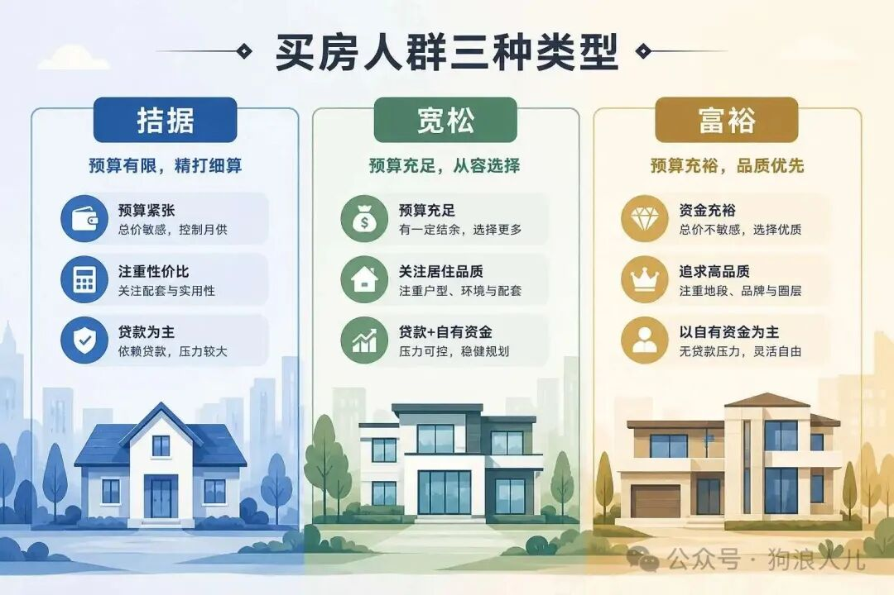

> 本文原载于我的微信公众号「狗浪人儿」，发布于 2026 年 5 月 24 日。[查看原文](https://mp.weixin.qq.com/s/YH_Inb7dkopTM1ik6A7unQ)。

## 事情的起因

讨论源自午饭后和同事一起散步，不经意的聊到了房子，虽说只有简单几句，但我觉得聊的比较深刻、彻底，于是决定分享出来。

> 写在前面：大家理性看待少吵多思考，希望都有 信息交换或者情绪价值。

## 观点竟然出奇的一致

<strong>沟通的核心在于 “信息交换”</strong>

往往大家聊天过程中难免有思想碰撞、或多或少，从投资、教育、工作，我也总有大收获，但是关于房子这个大话题却是个意外。

甚至我觉得，在房价和买房这件事上其实是有局部最优解的（个人观点，下面阐述）。

### 观点一，买房确定解

大家常说买房是“刚需”，这里其实有一个误解，“居住和住房”是刚需，而“买房”不是。

刚需的定义是生活、即“生下来活下去”，包括“衣食住行”。

<strong>废话少说，先给结论</strong>，

我们一致觉得不同的人情况不同，但依据买房能力大致可分三类：

- <strong>拮据</strong>：买房吃力，需要贷款/借钱、负债n年，<u>生活质量大幅下降</u>。如存款几十万及以下。
- <strong>宽松</strong>：有购房能力，买房前后<u>生活质量变化不大</u>。如存款几十几百万，具体参考城市房价。
- <strong>富裕</strong>：<u>轻松购房</u>，完全解决好基础马斯洛需求，如存款几百几千万。

我们分类讨论。

<strong>富裕</strong>：这些人的房子属于资产配置，同大宗商品黄金等资产，目标是追求资产升值。<strong>本质上是投资</strong>，这类行为涉及<u>风险与收益评估、比例配置等等</u>，比较依赖个人判断力。

有高点就有低点，这类情况比较简单，是投资的领域问题，和房子的居住属性无关。

<strong>宽松</strong>：虽说买房不是刚需，频繁搬家也是一个解法。但对老人或者不爱搬家的人来说依然体验有损，这类人买房更多追求情绪价值。

总结来说，<u>有溢价，但是可接受，并且能承受</u>。

<strong>比如校招同事选择前两年工资全款给父母换电梯房，随着房价软着陆，适当”接盘“换来的是体验和情绪价值。</strong>

<strong>拮据</strong>：掏空n口人钱包，换来他人或者自我所谓认可，牺牲青春和生活质量。我们认为完全不可取，具体原因见观点二。

## 观点二：30年杠杆的本质是在赌博

很多人对30年贷款没有概念，是因为一点不了解金融和经济学，<u>甚至没炒过股</u>。

<strong>这个行为的本质是在用无限倍杠杆笃定房价未来一定上涨。</strong>

举个例子，假如我相信腾讯未来一定会成为世界第一，所以我现在倾家荡产，把我父母未来30年的生活积蓄拿出来梭哈。

大家觉得可行吗。

这个行为其实和30年贷款无异，如果把这个故事放在股市很多人觉得疯了，<strong>甚至连股票是啥都不懂的父老乡亲都觉得你个老赌鬼没救了。</strong>

连老父亲都会问你，这跟赌场炸金花、老虎机有啥区别？

欸，<u>这个事放房子上就有很多人敢</u>。

### 最终落了一套房

很多人会说，这两个行为不一样，买房到最后至少会落一套房。

那可别忘了，这可是牺牲了年少时的生活质量甚至是青春换来的。

而<strong>时间恰恰是最宝贵的东西</strong>。

任何东西都是有代价的，<u>其实你是在用自己的青春最宝贵的若干年甚至半辈子时光去换水泥砖，换所谓的归属感</u>。

OK，也许你会说我觉得值，这也无可厚非。

因为<strong>不同的人对宝贵时间的认知是不同的</strong>，对千亿富豪来说1天可能非常宝贵，拼命地、不惜重金地延长寿命，以此享受人生。

而对许多人来说几年时间却可以挥霍，无所谓。

### 赌博不可取

在投资中，如果我们把全家地房车等一切值钱的物件都卖了，梭哈买入期货，期待暴涨发家。

这本身就是不理性的，不被接受的，<strong>无论最后是赚是赔</strong>。

这个行为本质上就是错的，和赌徒无异。

<strong>财富增长的底线是保住本金</strong>，通过资产配置的方式尽可能降低风险，而不是一夜暴富。

## 所以呢

我一直觉得投资不是投机，我本人拿着我不懂的股票也会睡不着，看着涨跌心情无法平复。

这更像人性，就像很多人上头追涨杀跌一样。

这种感觉很像赌场牌桌上的筹码交换，后来我把这些都清仓了，买入了我认真研究、长期投资的标的。

希望大家在这些关键节点上都能<strong>思考本质、理性交易</strong>，做出最合理的判断。

## 番外篇

有人会说（我同事也说），”你是不是站着说话不腰疼？假如是你在21年看着一直上涨的，和过去几十年新中国不断上涨的房价会不买？“

<strong>“那如果是刚需，早晚都买的话为啥不尽早在便宜时买？”</strong>

的确很有道理。可问题是<u>你我这样的普通人怎么做出判断</u>？

<strong>足够的信息输入是合理判断的基础。</strong>

为此我去做了很多了解和学习，目标是普通人怎么在那个时期做出准确或者是模糊判断。

先写这么多，这里省略一部分，欢迎大家一起讨论进步。
